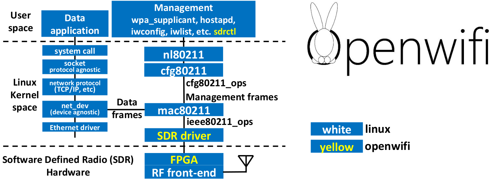

# openwifi


**openwifi:** Linux mac80211 compatible full-stack Wi-Fi design based on SDR (Software Defined Radio).

This repository includes Linux driver and software. [openwifi-hw](https://github.com/open-sdr/openwifi-hw) repository has the FPGA design. [[Detailed architecture](https://github.com/open-sdr/openwifi/tree/master/doc)]

[Demo [video](https://youtu.be/NpjEaszd5u4). Video [download](https://users.ugent.be/~xjiao/openwifi-low-aac.mp4)]   [openwifi [maillist](https://lists.ugent.be/wws/subscribe/openwifi)]

Openwifi code has dual licenses. AGPLv3 is the opensource license. For non-opensource license, please contact Filip.Louagie@UGent.be. Openwifi project also leverages some 3rd party modules. It is your duty to check and follow licenses of those modules according to your purpose. You can find [an example explanation from Analog Devices](https://github.com/analogdevicesinc/hdl/blob/master/LICENSE) for this compound license conditions.

Openwifi was born in [ORCA project](https://www.orca-project.eu/) (EU's Horizon2020 programme under agreement number 732174).

**Features:**

* 802.11a/g; 802.11n MCS 0~7; 20MHz
* Mode tested: Ad-hoc; Station; AP
* DCF (CSMA/CA) low MAC layer in FPGA
* Configurable channel access priority parameters:
  * duration of RTS/CTS, CTS-to-self
  * SIFS/DIFS/xIFS/slot-time/CW/etc
* Time slicing based on MAC address
* Easy to change bandwidth and frequency: 
  * 2MHz for 802.11ah in sub-GHz
  * 10MHz for 802.11p/vehicle in 5.9GHz
* On roadmap: **802.11ax**

**Performance (AP: openwifi at channel 44, client: TL-WDN4200 N900 Wireless Dual Band USB Adapter. iperf test):**
* AP --> client: 30.6Mbps(TCP), 38.8Mbps(UDP)
* client --> AP: 17.0Mbps(TCP), 21.5Mbps(UDP)

**Supported SDR platforms:**

* zc706 (Xilinx) + fmcomms2/fmcomms4 (Analog Devices)
* On roadmap: ADRV9361-Z7035/ADRV9364-Z7020 + ADRV1CRR-BOB (Analog Devices)
* On roadmap: zcu102 (Xilinx) + fmcomms2/fmcomms4/ADRV9371 (Analog Devices)
* Don't have any boards? Or you like JTAG boot instead of SD card? Check our test bed [w-iLab.t](https://doc.ilabt.imec.be/ilabt/wilab/tutorials/openwifi.html) tutorial.
        
**Quick start:** (Example instructions are verified on Ubuntu 16/18)

* Download pre-built [openwifi Linux img file](https://users.ugent.be/~xjiao/openwifi-1.0.0-ghent.zip). Burn the img file to a 16G SD card:

```
sudo dd bs=4M if=openwifi-1.0.0-ghent.img of=/dev/mmcblk0
(mmcblk0 is the dev name of sdcard in Linux. Make sure you use the correct one in your situation!)
(Above command takes a while)
```
* Connect RX/TX antenna to RX1A/TX2A ports of your zc706+fmcomms2 platform, and make two antennas orthogonal to each other for good isolation. Config zc706 to SD card boot mode by switches (Read zc706 board spec on internet). Insert the SD card to zc706. (For fmcomms4/ad9364, you may connect antennas to TXA/RXA)

* Connect the board to PC. (PC IP address should be 192.168.10.1). Power on the board. Then from PC:

```
ssh root@192.168.10.122
(password: openwifi)
cd openwifi
service network-manager stop
./wgd.sh
(For fmcomms4, you need an extra command: ./set_ant.sh rx1 tx1)
ifconfig sdr0 up
iwlist sdr0 scan
(you should see the Wi-Fi scan result)
```
* Setup openwifi hotspot over topology: client -- (sdr0)|board|(eth0) -- (***ethX***)|PC|(***ethY***) -- internet
  * Enable IPv4 **IP forwarding** on both **board** and **PC**
  * Then, on board:

        ifconfig sdr0 192.168.13.1
        route add default gw 192.168.10.1
        service isc-dhcp-server restart
        hostapd hostapd-openwifi.conf
  * Then, on PC:

        sudo iptables -t nat -A POSTROUTING -o ethY -j MASQUERADE
        sudo ip route add 192.168.13.0/24 via 192.168.10.122 dev ethX
  * Now you can connect openwifi by your devices (phone, laptop, etc)
* Connect openwifi to another hotspot. Terminate hostapd, edit wpa-connect.conf properly, then:
        
        ./wgd.sh
        (For fmcomms4, you need an extra command: ./set_ant.sh rx1 tx1)
        route del default gw 192.168.10.1
        wpa_supplicant -i sdr0 -c wpa-connect.conf
        (Wait for connection done, then open another ssh terminal)
        dhclient sdr0
        (Wait for its done, then you should have connection)
        
* ***Note***: If openwifi stops working after ~2 hours, it means the evaluation license of Xilinx Viterbi decoder has expired. You need to power cycle the board. Run this command several times on board to confirm:
  
        root@analog:~/openwifi# ./sdrctl dev sdr0 get reg rx 20
        SENDaddr: 00040050
        reg  val: 34be0123
        (If the last number of reg val is always 3, that means the Viterbi decoder stops working)
* Real-time control/config via sdrctl (time slice config, etc), please go to openwifi/doc.

**Build openwifi Linux img based on openwifi FPGA and driver:**

* Install Vivado/SDK 2017.4.1 (If you don't need to re-compile FPGA, WebPack version without license is enough)
* Get pre-built FPGA files from openwifi-hw repository.

```
git submodule init openwifi-hw
git submodule update openwifi-hw
cd openwifi-hw
git checkout master
git pull
```
* Build Linux kernel and modules:

```
export XILINX_DIR=your_Xilinx_directory
cd openwifi
git submodule init adi-linux
git submodule update adi-linux
(Will take a while)
cd adi-linux
git reset --hard 4220d5d24c6c7589fc702db4f941f0632b5ad767
cp ../kernel_boot/kernel_config ./.config
source $XILINX_DIR/SDK/2017.4/settings64.sh
export ARCH=arm
export CROSS_COMPILE=arm-linux-gnueabihf-
make -j12 UIMAGE_LOADADDR=0x8000 uImage
(Answer "y" to Xilinx DMA Engines (XILINX_DMA_ENGINES) [N/y/?] (NEW))
make modules
```
* Build openwifi Linux driver modules:

```
export OPENWIFI_DIR=your_openwifi_directory
cd $OPENWIFI_DIR/driver
./make_all.sh $XILINX_DIR/SDK/2017.4/ $OPENWIFI_DIR/adi-linux/
```
* Build openwifi Linux devicetree:

```
cd $OPENWIFI_DIR/kernel_boot
dtc -I dts -O dtb -o devicetree.dtb devicetree.dts
```
* Build openwifi BOOT.BIN based on FPGA files generated in openwifi-hw:

```
cd $OPENWIFI_DIR/kernel_boot
source $XILINX_DIR/Vivado/2017.4/settings64.sh
./build_boot_bin.sh ../openwifi-hw/zc706_fmcs2/sdk/system_top_hw_platform_0/system.hdf u-boot-zc70x.elf
(u-boot-zc70x.elf is included in the original Analog Devices Linux img)
```
* Download [2017_R1-2018_01_29.img.xz](http://swdownloads.analog.com/cse/2017_R1-2018_01_29.img.xz) from [Analog Devices Wiki](https://wiki.analog.com/resources/tools-software/linux-software/zynq_images). Burn it into a SD card via your PC.
* Mount SD card BOOT/rootfs partitions to SDCARD_DIR directory of your PC (If it is mounted automatically, find the directory). Then copy built files to SD card via your PC. (You can also update files over ftp/ssh after your full system runs. Please check next section. Read carefully user_space/sdcard_boot_update.sh and set your ftp root directory to $OPENWIFI_DIR in your PC):

```
export SDCARD_DIR=sdcard_mount_point
cp $OPENWIFI_DIR/kernel_boot/devicetree.dtb $SDCARD_DIR/BOOT
cp $OPENWIFI_DIR/kernel_boot/output_boot_bin/BOOT.BIN $SDCARD_DIR/BOOT
cp $OPENWIFI_DIR/adi-linux/arch/arm/boot/uImage $SDCARD_DIR/BOOT
cd $SDCARD_DIR/BOOT
sync

sudo mkdir $SDCARD_DIR/rootfs/root/openwifi
sudo find $OPENWIFI_DIR/driver -name \*.ko -exec cp {} $SDCARD_DIR/rootfs/root/openwifi/ \;
sudo cp $OPENWIFI_DIR/user_space/* $SDCARD_DIR/rootfs/root/openwifi/ 

sudo mkdir $SDCARD_DIR/rootfs/lib/modules
sudo mkdir $SDCARD_DIR/rootfs/lib/modules/4.14.0-g4220d5d24c6c
sudo find $OPENWIFI_DIR/adi-linux -name \*.ko -exec cp {} $SDCARD_DIR/rootfs/lib/modules/4.14.0-g4220d5d24c6c/ \;
sudo rm $SDCARD_DIR/rootfs/lib/modules/4.14.0-g4220d5d24c6c/{axidmatest.ko,xilinx_dma.ko,adi_axi_hdmi.ko,ad9361_drv.ko} -f

sudo rm $SDCARD_DIR/rootfs/etc/udev/rules.d/70-persistent-net.rules
sudo cp $OPENWIFI_DIR/kernel_boot/70-persistent-net.rules $SDCARD_DIR/rootfs/etc/udev/rules.d/
(Above rule will auto-rename wlan0 to sdr0 which is the openwifi NIC name)
cd $SDCARD_DIR/rootfs
sync
```
**Run Linux and do some post-config:**

* Insert the SD card to the board, power on and run serial console (such as minicom) from a PC via USB-UART cable to the board. After booting completes, in the PC serial console:

```
ln -s /lib/modules/4.14.0-g4220d5d24c6c /lib/modules/4.14.0-g4220d5d
(in case some Linux use short hash)
depmod
(Ignore the error messages)
modprobe mac80211
cd openwifi
./wgd.sh
(For fmcomms4, you need an extra command: ./set_ant.sh rx1 tx1)
(Wait for the completion)
ifconfig
(You should see sdr0 interface)
iwlist sdr0 scan
(You should see the Wi-Fi scan results)
```
* Config ssh server and ethernet IP address of the board. In the PC serial console:

```
passwd
(ssh server needs a password, such as "openwifi")
Add "UseDNS no" to /etc/ssh/sshd_config, otherwise ssh login takes too long time
Set static IP to board (If you have DHCP server on PC, you can skip this step)
Add following content to /etc/network/interfaces
  auto lo eth0
  iface lo inet loopback
  iface eth0 inet static
          address 192.168.10.122
          netmask 255.255.255.0
Add following content to /etc/resolv.conf
  nameserver 8.8.8.8
  nameserver 4.4.4.4

Disable update (long time hang) on boot or ssh session:
  sudo chmod -x /etc/update-motd.d/90-updates-available
  sudo chmod -x /etc/update-motd.d/91-release-upgrade

reboot the board, and set proper IP (192.168.10.1) of the connected PC, then from the PC:
ssh roo@192.168.10.122
(password: openwifi)
```
* Make on board file update easier:
  * Option 1: Access the board disk/rootfs from Ubuntu PC: "File manager --> Connect to Server...", input: sftp://root@192.168.10.122/root . Then you can operate files on board like normal files on your disk. To update files that need to be in boot partition (BOOT.BIN, uImage and devicetree.dtb), you can transfer those files to rootfs firstly, then on board:
  
         mount /dev/mmcblk0p1 /sdcard
         (Create /sdcard directory firstly if it doesn't exist)
         cp file /sdcard
         cd /sdcard
         sync
         cd /
         umount /sdcard
         (Remember to power cycle the board)
  * Option 2: Setup [ftp server](https://help.ubuntu.com/lts/serverguide/ftp-server.html) on PC, allow anonymous and change ftp root directory to $OPENWIFI_DIR. Then on board:
  
        ./sdcard_boot_update.sh
        (Above command downloads uImage, BOOT.BIN and devicetree.dtb, then copy them into boot partition. Remember to power cycle)
        ./wgd.sh remote
        (Above command downloads driver files, and brings up sdr0)
        (For fmcomms4, you need an extra command: ./set_ant.sh rx1 tx1)

**Compile sdrctl on the board** ("On the board" means that you login to the board via ssh)

```
sudo apt-get install libnl-3-dev
sudo apt-get install libnl-genl-3-dev
(Please find the next section to see how to connect board to the internet via your PC)
(or find out .deb files by above commands and copy .deb to the board, if you do not have internet)

copy $OPENWIFI_DIR/user_space/sdrctl_src to the board, then on the board:
cd sdrctl_src
chmod +x version.sh
make
```
**Internet config**
* Connect board to internet. Topology: board|(eth0) -- (***ethX***)|PC|(***ethY***) -- internet
  * Enable IPv4 **IP forwarding** on both **board** and **PC**
  * On board:
  ```
  route add default gw 192.168.10.1
  ```
  * On PC. After this your board should have internet via NAT through your PC.

  ```
  sudo iptables -t nat -A POSTROUTING -o ethY -j MASQUERADE
  ```
* Setup AP for Wi-Fi client. Topology: client -- (sdr0)|board|(eth0) -- (***ethX***)|PC|(***ethY***) -- internet
  * On board: Install dhcp server preparing for serving your openwifi clients via hostapd.

  ```
  sudo apt-get install isc-dhcp-server
  sudo apt-get install Haveged
  sudo apt-get install hostapd
  ```
  * Put user_space/dhcpd.conf into (overwrite) /etc/dhcp/dhcpd.conf on board.
  * On board: 

  ```
  cd openwifi
  service network-manager stop
  ./wgd.sh
  (For fmcomms4, you need an extra command: ./set_ant.sh rx1 tx1)
  ifconfig sdr0 up
  ifconfig sdr0 192.168.13.1
  route add default gw 192.168.10.1
  service isc-dhcp-server restart
  hostapd hostapd-openwifi.conf
  ```
  * On PC:

  ```
  sudo ip route add 192.168.13.0/24 via 192.168.10.122 dev ethX
  ```
  * Now you can connect openwifi hotspot from your phone/laptop and access the internet.
