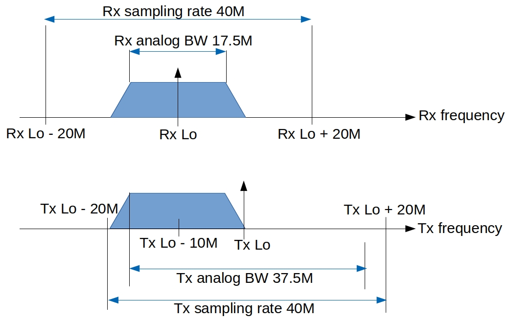

<!--
Author: Xianjun jiao, Michael Mehari, Wei Liu
SPDX-FileCopyrightText: 2019 UGent
SPDX-License-Identifier: AGPL-3.0-or-later
-->


# Openwifi document


Above figure shows software and hardware/FPGA modules that compose the openwifi design. The module name is equal/similar to the source code file name. Driver module source codes are in openwifi/driver/. FPGA module source codes are in openwifi-hw repository. The user space tool sdrctl source code are in openwifi/user_space/sdrctl_src/.

- [Driver and software overall principle](#Driver-and-software-overall-principle)
- [sdrctl command](#sdrctl-command)
- [Rx packet flow and filtering config](#Rx-packet-flow-and-filtering-config)
- [Tx packet flow and config](#Tx-packet-flow-and-config)
- [Regulation and channel config](#Regulation-and-channel-config)
- [Analog and digital frequency design](#Analog-and-digital-frequency-design)
- [Debug methods](#Debug-methods)
- [Application notes](app_notes)

## Driver and software overall principle

[Linux mac80211 subsystem](https://www.kernel.org/doc/html/v4.16/driver-api/80211/mac80211.html), as a part of [Linux wireless](https://wireless.wiki.kernel.org/en/developers/documentation/mac80211), defines a set of APIs ([ieee80211_ops](https://www.kernel.org/doc/html/v4.9/80211/mac80211.html#c.ieee80211_ops)) to rule the Wi-Fi chip driver behavior. SoftMAC Wi-Fi chip driver implements (subset of) those APIs. That is why Linux can support so many Wi-Fi chips of different chip vendors.

openwifi driver (sdr.c) implements following APIs of ieee80211_ops:
-	**tx**. It is called when upper layer has a packet to send
-	**start**. It is called when NIC up. (ifconfig sdr0 up)
-	**stop**. It is called when NIC down. (ifconfig sdr0 down)
-	**add_interface**. It is called when NIC is created
-	**remove_interface**. It is called when NIC is deleted
-	**config**. It is called when upper layer wants to change channel/frequency (like the scan operation)
-	**bss_info_changed**. It is called when upper layer believe some BSS parameters need to be changed (BSSID, TX power, beacon interval, etc)
-	**conf_tx**. It is called when upper layer needs to config/change some tx parameters (AIFS, CW_MIN, CW_MAX, TXOP, etc)
-	**prepare_multicast**. It is called when upper layer needs to prepare multicast, currently only a empty function hook is present.
-	**configure_filter**. It is called when upper layer wants to config/change the [frame filtering](#Rx-packet-flow-and-filtering-config) rule in FPGA.
-	**rfkill_poll**. It is called when upper layer wants to know the RF status (ON/OFF).
-	**get_tsf**. It is called when upper layer wants to get 64bit FPGA timer value (TSF - Timing synchronization function) 
-	**set_tsf**. It is called when upper layer wants to set 64bit FPGA timer value
-	**reset_tsf**. It is called when upper layer wants to reset 64bit FPGA timer value
-	**set_rts_threshold**. It is called when upper layer wants to change the threshold (packet length) for turning on RTS mechanism
-	**testmode_cmd**. It is called when upper layer has test command for us. [sdrctl command](#sdrctl-command) message is handled by this function.

Above APIs are called by upper layer (Linux mac80211 subsystem). When they are called, the driver (sdr.c) will do necessary job over SDR platform. If necessary, the driver will call other component drivers, like tx_intf_api/rx_intf_api/openofdm_tx_api/openofdm_rx_api/xpu_api, for help.

After receiving a packet from the air, FPGA will raise interrupt (if the frame filtering rule allows) to Linux, then the function openwifi_rx_interrupt() of openwifi driver (sdr.c) will be triggered. In that function, ieee80211_rx_irqsafe() API is used to give the packet and related information (timestamp, rssi, etc) to upper layer.

The packet sending is initiated by upper layer. After the packet is sent by the driver over FPGA to the air, the upper layer will expect a sending report from the driver. Each time FPGA sends a packet, an interrupt will be raised to Linux and trigger openwifi_tx_interrupt(). This function will report the sending result (failed? succeeded? number of retransmissions, etc.) to upper layer via ieee80211_tx_status_irqsafe() API.

## sdrctl command

Besides the Linux native Wi-Fi control programs, such as ifconfig/iw/iwconfig/iwlist/wpa_supplicant/hostapd/etc, openwifi offers a user space tool sdrctl to access openwifi specific functionalities, such as time sharing of the interface between two network slices, you may find more details of the slicing mechanism [here](https://doc.ilabt.imec.be/ilabt/wilab/tutorials/openwifi.html#sdr-tx-time-slicing).

sdrctl is implemented as nl80211 testmode command and communicates with openwifi driver (function openwifi_testmode_cmd() in sdr.c) via Linux nl80211--cfg80211--mac80211 path 

### Get and set a parameter
```
sdrctl dev sdr0 get para_name
sdrctl dev sdr0 set para_name value 
```
para_name|meaning|comment
---------|-------|----
slice_idx|the slice that will be set/get|0 to 3. After finishing all slice config, **set slice_idx to 4** to synchronize all slices. Otherwise the start/end of different slices have different actual time
addr|target MAC address of tx slice_idx|32bit. for address 6c:fd:b9:4c:b1:c1, you set b94cb1c1
slice_total|tx slice_idx cycle length in us|for length 50ms, you set 49999
slice_start|tx slice_idx cycle start time in us|for start at 10ms, you set 10000
slice_end|  tx slice_idx cycle end   time in us|for end   at 40ms, you set 39999
tsf| sets TSF value| it requires two values "high_TSF low_TSF". Decimal

### Get and set a register of a module
```
sdrctl dev sdr0 get reg module_name reg_idx
sdrctl dev sdr0 set reg module_name reg_idx reg_value 
```
module_name drv_rx/drv_tx/drv_xpu refers to the corresponding driver functionality. Related registers are defined in sdr.h. Search drv_rx_reg_val/drv_tx_reg_val/drv_xpu_reg_val in sdr.c to see their functionalities.

module_name rf/rx_intf/tx_intf/rx/tx/xpu refer to RF (ad9xxx front-end) and FPGA modules (rx_intf/tx_intf/openofdm_rx/openofdm_tx/xpu). Related register addresses are defined in hw_def.h and mapped to slv_regX in .v file (X is the register index). Check rx_intf/tx_intf/openofdm_rx/openofdm_tx/xpu.c and .v files to see their functionalities.

Please be aware that some registers are set by sdr.c in real-time (instructed by Linux mac80211), so be careful when set them manually.

module_name: **drv_rx** (for full list, search drv_rx_reg_val in sdr.c)

reg_idx|meaning|comment
-------|-------|----
1|rx antenna selection|0:rx1, 1:rx2. After this command, you should down and up sdr0 by ifconfig, but not reload sdr0 driver via ./wgd.sh
7|dmesg print control|bit0:error msg (0:OFF, 1:ON); bit1:regular msg (0:OFF, 1:ON)

(In the **comment** column, you may get a list of **decimalvalue(0xhexvalue):explanation** for a register, only use the **decimalvalue** in the sdrctl command)

module_name: **drv_tx** (for full list, search drv_tx_reg_val in sdr.c)

reg_idx|meaning|comment
-------|-------|----
0|override Linux rate control of tx unicast data packet|4:6M, 5:9M, 6:12M, 7:18M, 8:24M, 9:36M, 10:48M, 11:54M
1|tx antenna selection|0:tx1, 1:tx2. After this command, you should down and up sdr0 by ifconfig, but not reload sdr0 driver via ./wgd.sh
7|dmesg print control|bit0:error msg (0:OFF, 1:ON); bit1:regular msg (0:OFF, 1:ON)

module_name: **drv_xpu** (for full list, search drv_xpu_reg_val in sdr.c)

reg_idx|meaning|comment
-------|-------|----
7|git revision when build the driver|example: return value 0071bc74 means git revision is 071bc74 (the 1st 0 is always 0!)

module_name: **rf**

reg_idx|meaning|comment
-------|-------|----
x|x|to be defined

module_name: **rx_intf** (for full list, check rx_intf.c and **slv_reg** in rx_intf.v)

reg_idx|meaning|comment
-------|-------|----
1|trigger for ILA debug|bit4 and bit0. Please check slv_reg1 in rx_intf.v
2|enable/disable rx interrupt|256(0x100):disable, 0:enable
3|get loopback I/Q from tx_intf|256(0x100):from tx_intf, 0:from ad9361 ADC
11|rx digital I/Q gain|number of bit shift to left. default 4 in rx_intf.c: rx_intf_api->RX_INTF_REG_BB_GAIN_write(4)
13|delay from RX DMA complete to RX packet interrupt|unit 0.1us
16|rx antenna selection|0:ant0, 1:ant1. default 0 in rx_intf.c: rx_intf_api->RX_INTF_REG_ANT_SEL_write(ant_sel)

module_name: **tx_intf** (for full list, check tx_intf.c and **slv_reg** in tx_intf.v)

reg_idx|meaning|comment
-------|-------|----
1|DUC config|tx_intf_api->TX_INTF_REG_MIXER_CFG_write(mixer_cfg) in tx_intf.c and openwifi-hw/ip/mixer_duc/src/mixer_duc.cpp
4|CTS to Self config|auto set by cts_reg in openwifi_tx of sdr.c. bit31: enable/disable, bit30: rate selection: 1: use traffic rate, 0: manual rate in bit7-4, bit23-8: duration
6|CTS to Self sending delay (for SIFS)|unit 0.1us. bit13-0 for 2.4GHz, bit29-16 for 5GHz
11|threshold for FPGA fifo almost full|driver(sdr.c) read 1bit flag in slv_reg21 (4bit in total for 4 queue) to know the FPGA fifo/queue is almost full.
12|threshold to pause openofdm_tx|back pressure flow control for I/Q generation speed of openofdm_tx
13|tx I/Q digital gain before DUC|current optimal value: 100
14|enable/disable tx interrupt|196612(0x30004):disable, 4:enable
16|tx antenna selection|1:ant0, 2:ant1. default 1 in tx_intf.c: tx_intf_api->TX_INTF_REG_ANT_SEL_write(ant_sel)
21|queue almost full flag|4bit for 4 queue. criteria is the threshold in slv_reg11. check by tx_intf_api->TX_INTF_REG_S_AXIS_FIFO_NO_ROOM_read() in sdr.c

module_name: **rx** (for full list, check openofdm_rx.c and **slv_reg** in openofdm_rx.v)

reg_idx|meaning|comment
-------|-------|----
2|power trigger threshold|default 0. openofdm_rx.c: openofdm_rx_api->OPENOFDM_RX_REG_POWER_THRES_write(0)
3|minimum plateau used for short preamble detection|default 100. openofdm_rx.c: openofdm_rx_api->OPENOFDM_RX_REG_MIN_PLATEAU_write(100)
4|soft or hard decision for viterbi decoder|0:hard, 1:soft. default 1. openofdm_rx.c: openofdm_rx_api->OPENOFDM_RX_REG_SOFT_DECODING_write(1)
20|history of PHY rx state|read only. If the last digit readback is always 3, it means the Viterbi decoder stops working

module_name: **tx** (for full list, check openofdm_tx.c and **slv_reg** in openofdm_tx.v)

reg_idx|meaning|comment
-------|-------|----
1|pilot scrambler initial state|lowest 7 bits are used. 0x7E by default in openofdm_tx.c
2|data  scrambler initial state|lowest 7 bits are used. 0x7F by default in openofdm_tx.c

module_name: **xpu** (for full list, check xpu.c and **slv_reg** in xpu.v)

reg_idx|meaning|comment
-------|-------|----
1|mute rx I/Q when tx|0:mute when tx, 1:unmute, which means rx baseband will receive tx signal from its own. Rx packet and tx packet (such as ACK) can be monitored in FPGA for timing analysis
2|TSF timer low  32bit write|only write this register won't trigger the TSF timer reload. should use together with register for high 31bit
3|TSF timer high 31bit write|falling edge of MSB will trigger the TSF timer reload, which means write '1' then '0' to MSB
4|band, channel and ERP short slot setting|see enum/define in hw_def.h. set automatically by Linux. manual set will be overrided unless you change sdr.c
5|DIFS and backoff advance (us)|advance (us) for tx preparation before the end of DIFS/backoff. bit7-0:DIFS advance, bit15-8: backoff advance
6|forced idle, CSMA settings|bit7-0: forced channel idle (us) after decoding done to avoid false alarm caused by strong "AGC tail" signal. bit31: NAV enable, bit30: DIFS enable, bit29: EIFS enable, bit28: dynamic CW enable (when disable, CW is taken from bit3-0 of register 19)
7|some RSSI and delay setting|please check xpu.v (search slv_reg7)
8|RSSI threshold for channel idle/busy|set by ad9361_rf_set_channel --> xpu_api->XPU_REG_LBT_TH_write
9|some time setting|bit31 0:auto, 1:manual. When manual, bit6-0: PHY rx delay, bit13-7: SIFS, bit18-14: slot time, bit23-19: ofdm symbol time, bit30-24: preamble+SIG time. unit us. check xpu.v (search slv_reg9)
10|BB RF delay setting|bit7-0: BB RF delay (0.1us), bit11-8: RF end extended time (0.1us). check xpu.v (search slv_reg10)
11|ACK control and max num retransmission|bit4: 0:normal ACK, 1:disable auto ACK reply in FPGA. bit3-0: 0: the number of retransmission is decided by Linux, non-zero: Linux auto setting about num of retransmission will be replaced by this value
16|setting when wait for ACK in 2.4GHz|unit 0.1us. bit14-0:  OFDM decoding timeout (after detect PHY header), bit30-16: timeout for PHY header detection, bit31: 0: FCS valid is not needed for ACK packet, 1: FCS valid is needed for ACK packet
17|setting when wait for ACK in 5GHz|unit 0.1us. bit14-0:  OFDM decoding timeout (after detect PHY header), bit30-16: timeout for PHY header detection, bit31: 0: FCS valid is not needed for ACK packet, 1: FCS valid is needed for ACK packet
18|setting for sending ACK|unit 0.1us. bit14-0: ACK sending delay in 2.4GHz, bit30-16: ACK sending delay in 5GHz
19|CW min and max setting for 4 FPGA queues|bit3-0: CW min for queue 0, bit7-4: CW max for queue 0, bit11-8: CW min for queue 1, bit15-12: CW max for queue 1, bit19-16: CW min for queue 2, bit23-20: CW max for queue 2, bit27-24: CW min for queue 3, bit31-28: CW max for queue 3. automatically set by openwifi_conf_tx of sdr.c
26|CTS to RTS setting|bit15-0: extra duration, bit20-16: rate/MCS, bit31: 0:enable CTStoRTS 1:disable CTStoRTS
27|FPGA packet filter config|check openwifi_configure_filter in sdr.c. also [mac80211 frame filtering](https://www.kernel.org/doc/html/v4.9/80211/mac80211.html#frame-filtering)
28|BSSID address low  32bit for BSSID filtering|auto set by xpu_api->XPU_REG_BSSID_FILTER_LOW_write in openwifi_bss_info_changed of sdr.c
29|BSSID address high 32bit for BSSID filtering|auto set by xpu_api->XPU_REG_BSSID_FILTER_HIGH_write in openwifi_bss_info_changed of sdr.c
30|MAC address low  32bit|auto set by XPU_REG_MAC_ADDR_write in sdr.c
31|MAC address high 32bit|auto set by XPU_REG_MAC_ADDR_write in sdr.c
58|TSF runtime value low  32bit|read only
59|TSF runtime value high 32bit|read only
63|git revision when build the FPGA|example: return value 065272ac means git revision is 65272ac (the 1st 0 is always 0)

## Rx packet flow and filtering config

After FPGA receives a packet, no matter the FCS/CRC is correct or not it will raise interrupt to Linux if the frame filtering rule allows (See also [mac80211 frame filtering](https://www.kernel.org/doc/html/v4.9/80211/mac80211.html#frame-filtering)). openwifi_rx_interrupt() function in sdr.c serves the interrupt and gives the necessary information to upper layer (Linux mac80211 subsystem) via ieee80211_rx_irqsafe.

- frame filtering

The FPGA frame filtering configuration is done in real-time by function openwifi_configure_filter() in sdr.c. The filter_flag together with **HIGH_PRIORITY_DISCARD_FLAG** finally go to pkt_filter_ctl.v of xpu module in FPGA, and control how FPGA does frame filtering. Openwifi has the capability to capture all received packets even if the CRC is bad. You just need to set the NIC to monitor mode by iwconfig command (check monitor_ch.sh in user_space directory). In monitor mode, all received packets (including ACK) will be given to Linux mac80211. 

- main rx interrupt operations in openwifi_rx_interrupt()
  - get raw content from DMA buffer. When Linux receives interrupt from FPGA rx_intf module, the content has been ready in Linux DMA buffer
  - parse extra information inserted by FPGA in the DMA buffer
    - TSF timer value
    - raw RSSI value that will be converted to actual RSSI in dBm by different correction in different bands/channels
    - packet length and MCS
    - FCS is valid or not
  - send packet content and necessary extra information to upper layer via ieee80211_rx_irqsafe()

## Tx packet flow and config

Linux mac80211 subsystem calls openwifi_tx() to initiate a packet sending. 

- main operations in openwifi_tx()
  - get necessary information from the packet header (struct ieee80211_hdr) for future FPGA configuration
    - packet length and MCS
    - unicast or broadcast? does it need ACK? how many retransmissions at most are allowed to be tried by FPGA in case ACK is not received in time?
    - which queue (time slice) in FPGA the packet should go?
    - should RTS-CTS be used? (Send RTS and wait for CTS before actually send the data packet)
    - should CTS-to-self be used? (Send CTS-to-self packet before sending the data packet. You can force this on by force_use_cts_protect = true;)
    - should a sequence number be inserted?
  - generate SIGNAL field according to length and MCS information. Insert it before the packet for the future openofdm_tx FPGA module use
  - maintain sequence number (ring->bd_wr_idx) for internal use (cross check between Linux and FPGA)
  - config FPGA register according to the above information to help FPGA do correct actions according to the packet specific requirement.
  - fire DMA transmission from Linux to one of FPGA tx queues. The packet may not be sent immediately if there are still some packets in FPGA tx queue (FPGA does the queue packet transmission according to channel and low MAC state)
    
Each time when FPGA sends a packet, an interrupt will be raised to Linux reporting the packet sending result. This interrupt handler is openwifi_tx_interrupt().

- main operations in openwifi_tx_interrupt()
  - get necessary information/status of the packet just sent by FPGA
    - packet length and sequence number to capture abnormal situation (cross checking between Linux and FPGA)
    - packet sending result: packet is sent successfully (FPGA receives ACK for this packet) or not. How many retransmissions have been done (in case FPGA doesn't receive ACK in time, FPGA will do retransmission according to CSMA/CA low MAC state)
  - send above information to upper layer (Linux mac80211 subsystem) via ieee80211_tx_status_irqsafe()

## Regulation and channel config

SDR is a powerful tool for research. It is the user's responsibility to align with local spectrum regulation.

This section explains how openwifi config the frequency/channel range and change it in real-time. After knowing the mechanism, you can try to extend frequency/channel by yourself.

### Frequency range

When openwifi driver is loaded, openwifi_dev_probe() will be executed. Following two lines configure the frequency range:
```
dev->wiphy->regulatory_flags = xxx
wiphy_apply_custom_regulatory(dev->wiphy, &sdr_regd);
```
sdr_regd is the predefined variable in sdr.h. You can search the definition/meaning of its type: struct ieee80211_regdomain. 
Then it is not difficult to find out how to change the frequency range in SDR_2GHZ_CH01_14 and SDR_5GHZ_CH36_64.

### Supported channel

The supported channel list is defined in openwifi_2GHz_channels and openwifi_5GHz_channels in sdr.h. If you change the number of supported channels, make sure you also change the frequency range in sdr_regd accordingly and also array size of the following two fields in the struct openwifi_priv:
```
struct ieee80211_channel channels_2GHz[14];
struct ieee80211_channel channels_5GHz[11];
```
Finally, the supported channel list is transferred to Linux mac80211 when openwifi driver is loaded by following two lines in openwifi_dev_probe():
```
dev->wiphy->bands[NL80211_BAND_2GHZ] = &(priv->band_2GHz);
dev->wiphy->bands[NL80211_BAND_5GHZ] = &(priv->band_5GHz);
```

### Real-time channel setting

Linux mac80211 (struct ieee80211_ops openwifi_ops in sdr.c) uses the "config" API to configure channel frequency and some other parameters in real-time (such as during scanning or channel setting by iwconfig). It is hooked to openwifi_config() in sdr.c, and supports only frequency setting currently. The real execution of frequency setting falls to ad9361_rf_set_channel() via the "set_chan" field of struct openwifi_rf_ops ad9361_rf_ops in sdr.c. Besides tuning RF front-end (AD9361), the ad9361_rf_set_channel() also handles RSSI compensation for different frequencies and FPGA configurations (SIFS, etc) for different bands.

## Analog and digital frequency design

Following figure shows the current openwifi analog and digital frequency design strategy. The Tx RF center frequency is tuned with 10MHz offset deliberately to ease Tx Lo leakage suppressed by Rx filter. This RF offset is pre-compensated by Tx DUC (Digital Up Converter) in FPGA (duc_bank_core.bd used by tx_intf.v). It combines AD9361's bandwidth, frequency, sampling rate and FPGA's digital up converter (duc_bank_core.bd) setting to achieve this example spectrum arrangement. Values in the figure are configurable in the openwifi design.


Above spectrum setting has two benefits:
- The Tx Lo leakage is suppressed by Rx filter
- The centered Rx Lo leads to more easy/accurate RSSI estimation in FPGA (together with real-time AD9361 AGC gain value accessed via FPGA GPIO)

Following figure shows the detailed configuration point in AD9361, driver (.c file) and related FPGA modules (.v file).


## Debug methods

### dmesg

To debug/see the basic driver behaviour, you could turn on **dmesg** message printing by 
```
./sdrctl dev sdr0 set reg drv_tx 7 X
./sdrctl dev sdr0 set reg drv_rx 7 X

The bit in value X controls what type of information will be printed to the dmesg (0--no print; 1--print).
bit0: error   message
bit1: regular message for unicast packet (openwifi_tx/openwifi_tx_interrupt/openwifi_rx_interrupt)
bit2: regular message for broadcast packet

For example, regular message for unicast packet and error message
./sdrctl dev sdr0 set reg drv_tx 7 3
./sdrctl dev sdr0 set reg drv_rx 7 3

For example, error message only:
./sdrctl dev sdr0 set reg drv_tx 7 1
./sdrctl dev sdr0 set reg drv_rx 7 1
```
and use **dmesg** command in Linux to see those messages. Regular printing includes tx/rx packet information when a packet is sent or received. Error printing has WARNING information if something abnormal happens. You can search "printk" in sdr.c to see all the printing points.

### tx printing example
```
sdr,sdr openwifi_tx: 1410bytes ht0 540M FC0208 DI002c addr1/2/3:2ec08902fdb2/6655443322ad/6655443322ad SC2100 flag40000012 retr6 ack1 prio2 q2 wr44 rd31
```
- printing from sdr driver, openwifi_tx function
- 1410bytes: packet size (length field in SIGNAL)
- ht0: non-ht means 11a/g; ht1 means 11n
- 54M: MCS (rate field in SIGNAL)
- FC0208: Frame Control field, which means type data, subtype data, to DS 0, from DS 1 (a packet from AP to client)
- DI002c: Duration/ID field 0x002c. How many us this packet will occupy the channel (including waiting for ACK)
- addr1/2/3: address fields. Target MAC address 2ec08902fdb2, source MAC address 6655443322ad (openwifi)
- SC2100: Sequence Control, which means that the driver inserts sequence number 0x2100 to the packet under request of Linux mac80211
- flag40000012: flags field from Linux mac80211 struct ieee80211_tx_info (first fragment? need ACK? need sequence number insertion? etc.)
- retry6: Linux mac80211 tells driver the maximum number of transmissions for this packet is 6
- ack1: Linux mac80211 tells driver this packet needs ACK
- prio2: Linux select priority queue 2 for this packet (0:VO voice, 1:VI video, 2:BE best effort and 3:BK background)
- q2: the packet goes to FPGA queue 2. (You can change the mapping between Linux priority and FPGA queue in sdr.c)
- wr44 rd31: the write/read index of buffer (shared buffer between the active openwifi_tx and background openwifi_tx_interrupt/FPGA)
  
### tx interrupt printing example
```
sdr,sdr openwifi_tx_interrupt: tx_result 02 prio2 wr28 rd25 num_rand_slot 21 cw 6 
```
- printing from sdr driver, openwifi_tx_interrupt function
- tx_result: 5bit, bit3~0 tells how many tx attempts are made on this packet, and bit4 indicates NO ACK (1) or an ACK (0) is received
- prio, wr, rd: these fields can be interpreted the same way as the print in openwifi_tx function
- num_rand_slot: tells how many slots the CSMA/CA state machine waited until the packet is sent in the last tx attempt
- cw: the exponent of the Contention Window for this packet. 6 means the CW size 64. If the contention phase is never entered, CW is 0
  
### rx printing example
```
sdr,sdr openwifi_rx_interrupt: 796bytes ht0 120M FC0108 DI0030 addr1/2/3:6655443322f4/2ec08902fdb2/6655443322f4 SC4760 fcs1 buf_idx13 -50dBm
```
- printing from sdr driver, openwifi_rx_interrupt function
- 796bytes: packet size (length field in SIGNAL)
- ht0: non-ht means 11a/g; ht1 means 11n
- 12M:  MCS (rate field in SIGNAL)
- FC0108: Frame Control field 0x0108, which means type data, subtype data, to DS 1, from DS 0 (a packet client to openwifi AP)
- DI0030: Duration/ID field 0x0030. How many us this packet will occupy the channel (including waiting for ACK)
- addr1/2/3: address fields. Target MAC address 6655443322f4 (openwifi), source MAC address 2ec08902fdb2
- SC4760: Sequence Control, which means that the packet includes sequence number 0x4760 (under request of upper layer of the peer)
- fcs1: FCS/CRC is OK. (fcs0 means bad CRC)
- buf_idx13: current rx packet DMA buffer index 13
- -50dBm: signal strength of this received packet (after calibration)

### Native Linux tools

For analysis/debug, many native Linux tools you still could rely on. Such as tcpdump, tshark, etc.

### FPGA

For FPGA itself, FPGA developer could use Xilinx ILA tools to analyze FPGA signals. Spying on those state machines in xpu/tx_intf/rx_intf would be very helpful for understanding/debugging Wi-Fi low level functionalities.
