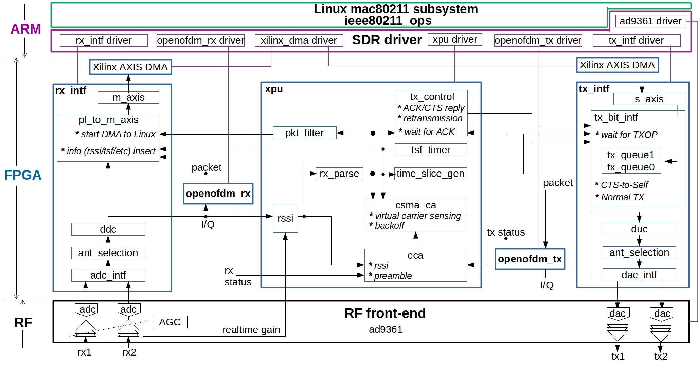

# openwifi document


Above figure shows software and hardware/FPGA modules that compose the openwifi design. The module name is equal/similar to the source code file name. Driver modules source code are in openwifi/driver/. FPGA modules source code are in openwifi-hw repository. The user space tool sdrctl source code are in openwifi/user_space/sdrctl_src/.

- [driver and software overall principle](#driver-and-software-overall-principle)
- [sdrctl command](#sdrctl-command)
- [rx packet flow and filtering config](#rx-packet-flow-and-filtering-config)
- [tx packet flow and config](#tx-packet-flow-and-config)
- [debug methods](#debug-methods)

## driver and software overall principle

[Linux mac80211 subsystem](https://www.kernel.org/doc/html/v4.16/driver-api/80211/mac80211.html), as a part of [Linux wireless](https://wireless.wiki.kernel.org/en/developers/documentation/mac80211) defines a set of APIs ([ieee80211_ops](https://www.kernel.org/doc/html/v4.9/80211/mac80211.html#c.ieee80211_ops)) to rule the Wi-Fi chip driver behavior. SoftMAC Wi-Fi chip driver implements (part of) APIs. That is why Linux can support so many types of Wi-Fi chip.

openwifi driver (sdr.c) implements following APIs of ieee80211_ops:
-	**tx**. It is called when upper layer has a packet to send
-	**start**. It is called when NIC up. (ifconfig sdr0 up)
-	**stop**. It is called when NIC down. (ifconfig sdr0 down)
-	**add_interface**. It is called when NIC is created
-	**remove_interface**. It is called when NIC is deleted
-	**config**. It is called when upper layer wants to change channel/frequency (like the scan operation)
-	**bss_info_changed**. It is called when upper layer believe some BSS parameters need to be changed (BSSID, TX power, beacon interval, etc)
-	**conf_tx**. It is called when upper layer needs to config/change some tx parameters (AIFS, CW_MIN, CW_MAX, TXOP, etc)
-	**prepare_multicast**. 
-	**configure_filter**. It is called when upper layer wants to config/change the [frame filtering](https://www.kernel.org/doc/html/v4.9/80211/mac80211.html#frame-filtering) rule in FPGA.
-	**rfkill_poll**. It is called when upper layer wants to know the RF status (ON/OFF).
-	**get_tsf**. It is called when upper layer wants to get 64bit FPGA timer value (TSF - Timing synchronization function) 
-	**set_tsf**. It is called when upper layer wants to set 64bit FPGA timer value
-	**reset_tsf**. It is called when upper layer wants to reset 64bit FPGA timer value
-	**set_rts_threshold**. It is called when upper layer wants to change the threshold (packet length) for turning on RTS mechanism
-	**testmode_cmd**. It is called when upper layer has test command for us. [sdrctl command](#sdrctl-command) message is handled by this function.

Above APIs are called actively by upper layer. When they are called, the driver (sdr.c) will do necessary job over SDR platform. If necessary the driver will call other component drivers (tx_intf_api/rx_intf_api/openofdm_tx_api/openofdm_rx_api/xpu_api) for helping.

For receiving a packet from the air, FPGA will raise interrupt (if the frame filtering rule allows) to Linux, then the function openwifi_rx_interrupt() of openwifi driver (sdr.c) will be triggered. In that function, ieee80211_rx_irqsafe() API is used to give the packet to upper layer.

The packet sending is initiated by upper layer. After the packet is sent by the driver to FPGA, the upper layer will expect a sending report from the driver. Each time FPGA send a packet, an interrupt will be raised to Linux and trigger openwifi_tx_interrupt(). This function will report the sending result (fail? succeed? number of retransmissions, etc.) to upper layer via ieee80211_tx_status_irqsafe() API.

## sdrctl command

Besides the Linux native Wi-Fi control programs, such as ifconfig/iw/iwconfig/iwlist/wpa_supplicant/hostapd/etc, openwifi offers a user space tool sdrctl to access openwifi specific functionalities. sdrctl is implemented as nl80211 testmode command and communicates with openwifi driver (function openwifi_testmode_cmd in sdr.c) via Linux nl80211--cfg80211--mac80211 path 

### get and set a parameter
```
sdrctl dev sdr0 get para_name
sdrctl dev sdr0 set para_name value 
```
para_name|meaning|example
---------|-------|----
addr0|target MAC address of tx slice 0|32bit. for address 6c:fd:b9:4c:b1:c1, you set b94cb1c1
slice_total0|tx slice 0 cycle length in us|for length 50ms, you set 49999
slice_start0|tx slice 0 cycle start time in us|for start at 10ms, you set 10000
slice_end0|  tx slice 0 cycle end   time in us|for end   at 40ms, you set 39999
addr1|target MAC address of tx slice 1|32bit. for address 6c:fd:b9:4c:b1:c1, you set b94cb1c1
slice_total1|tx slice 1 cycle length in us|for length 50ms, you set 49999
slice_start1|tx slice 1 cycle start time in us|for start at 10ms, you set 10000
slice_end1|  tx slice 1 cycle end   time in us|for end   at 40ms, you set 39999

### get and set a register of a module
```
sdrctl dev sdr0 get reg module_name reg_idx
sdrctl dev sdr0 set reg module_name reg_idx reg_value 
```
module_name drv_rx/drv_tx/drv_xpu refer to driver modules. Related registers are defined in sdr.h (drv_rx_reg_val/drv_tx_reg_val/drv_xpu_reg_val)

module_name rf/rx_intf/tx_intf/rx/tx/xpu refer to RF (ad9xxx front-end) and FPGA (rx_intf/tx_intf/openofdm_rx/openofdm_tx/xpu) modules. Related register addresses are defined in hw_def.h.

module_name: drv_rx

reg_idx|meaning|example
-------|-------|----
1|rx antenna selection|0:rx1, 1:rx2. After this command, you should down and up sdr0 by ifconfig, but not reload sdr0 driver via ./wgd.sh

module_name: drv_tx

reg_idx|meaning|example
-------|-------|----
0|override Linux rate control of tx unicast data packet|4:6M, 5:9M, 6:12M, 7:18M, 8:24M, 9:36M, 10:48M, 11:54M
1|tx antenna selection|0:tx1, 1:tx2. After this command, you should down and up sdr0 by ifconfig, but not reload sdr0 driver via ./wgd.sh

module_name: drv_xpu

reg_idx|meaning|example
-------|-------|----
x|x|x

module_name: rf

reg_idx|meaning|example
-------|-------|----
x|x|x

module_name: rx_intf

reg_idx|meaning|example
-------|-------|----
2|enable/disable rx interrupt|256(0x100):disable, 0:enable

module_name: tx_intf

reg_idx|meaning|example
-------|-------|----
13|tx I/Q digital gain before DUC|current optimal value: 237
14|enable/disable tx interrupt|196672(0x30040):disable, 64(0x40):enable

module_name: rx

reg_idx|meaning|example
-------|-------|----
20|history of PHY rx state|read only. If the last digit readback is always 3, it means the Viterbi decoder stops working

module_name: tx

reg_idx|meaning|example
-------|-------|----
1|pilot scrambler initial state|lowest 7 bits are used. 0x7E by default in openofdm_tx.c
2|data  scrambler initial state|lowest 7 bits are used. 0x7F by default in openofdm_tx.c

module_name: xpu

reg_idx|meaning|example
-------|-------|----
2|TSF timer low  32bit write|only write this register won't trigger the TSF timer reload. should use together with register for high 32bit
3|TSF timer high 32bit write|falling edge of MSB will trigger the TSF timer reload, which means write '1' then '0' to MSB
4|band and channel number setting|see enum openwifi_band in hw_def.h. it will be set automatically by Linux. normally you shouldn't set it
11|max number of retransmission in FPGA|normally number of retransmissions controlled by Linux in real-time. If you write non-zeros value to this register, it will override Linux real-time setting
19|CSMA enable/disable|3758096384(0xe0000000): disable, 3:enable
20|tx slice 0 cycle length in us|for length 50ms, you set 49999
21|tx slice 0 cycle start time in us|for start at 10ms, you set 10000
22|tx slice 0 cycle end   time in us|for end   at 40ms, you set 39999
23|tx slice 1 cycle length in us|for length 50ms, you set 49999
24|tx slice 1 cycle start time in us|for start at 10ms, you set 10000
25|tx slice 1 cycle end   time in us|for end   at 40ms, you set 39999
27|FPGA packet filter config|check openwifi_configure_filter in sdr.c. also: https://www.kernel.org/doc/html/v4.9/80211/mac80211.html#frame-filtering
28|BSSID address low  32bit for BSSID filtering|normally it is set by Linux in real-time automatically
29|BSSID address high 32bit for BSSID filtering|normally it is set by Linux in real-time automatically
30|openwifi MAC address low  32bit|
31|openwifi MAC address high 32bit|check XPU_REG_MAC_ADDR_write in sdr.c to see how we set MAC address to FPGA when NIC start
58|TSF runtime value low  32bit|read only
59|TSF runtime value high 32bit|read only

## rx packet flow and filtering config

When FPGA received a packet, no matter the FCS/CRC is correct or not it will raise interrupt to Linux if the frame filtering full is met. openwifi_rx_interrupt() function in sdr.c will be triggered to do necessary operation and give the content to upper layer (Linux mac80211 subsystem).

- frame filtering

Because the FPGA frame filtering configuration is done in real-time by function openwifi_configure_filter() in sdr.c, you may not have all packet type you want even if you put your sdr0 to sniffing mode. But you do have the chance to do so by changing the filter_flag in openwifi_configure_filter() to override the frame filtering in FPGA with MONITOR_ALL. The filter_flag together with HIGH_PRIORITY_DISCARD_FLAG finally go to pkt_filter_ctl.v of xpu module in FPGA, and control how FPGA does frame filtering.

- main rx interrupt operations in openwifi_rx_interrupt()
  - get raw content from DMA buffer. When Linux receives interrupt from FPGA rx_intf module, that means the content has been ready in Linux DMA buffer
  - parse extra information inserted by FPGA in the DMA buffer
    - TSF timer value
    - raw RSSI value that will be converted to actual RSSI in dBm by different correction in different band
    - packet length and MCS
    - FCS is valid or not
  - send packet content and necessary extra information to upper layer via ieee80211_rx_irqsafe()

## tx packet flow and config

Linux mac80211 subsystem calls openwifi_tx() to initiate a packet sending. 

- main operations in openwifi_tx()
  - get necessary information from the packet header (struct ieee80211_hdr) for future FPGA configuration use
    - packet length and MCS
    - unicast or broadcast? does it need ACK? how many retransmissions are needed to be done by FPGA in case ACK is not received in time?
    - which time slice in FPGA the packet should go?
    - should RTS-CTS be used? (Send RTS and wait for CTS before actually send the data packet)
    - should CTS-to-self be used? (Send CTS-to-self packet before sending the data packet. You can force this on by force_use_cts_protect = true;)
    - should a sequence number be set for this packet?
  - generate SIGNAL field according to length and MCS information. Insert it before the packet for the future openofdm_tx use
  - generate FPGA/PHY sequence number (priv->phy_tx_sn) for internal use (between Linux and FPGA)
  - config FPGA register according to the above information to make sure FPGA do correct service according to the packet specific requirement.
  - fire DMA transmission from Linux to one of FPGA tx queues. The packet may not be sent immediately if there are still some packets in FPGA tx queue (FPGA does the queue packet transmission according to channel and low MAC state)
    
Each time when FPGA send a packet, an interrupt will be raised to Linux reporting the packet sending result. This interrupt handler is openwifi_tx_interrupt().

- main operations in openwifi_tx_interrupt()
  - get necessary information from the FPGA of the packet just sent
    - packet length and sequence number
    - packet sending result: packet is sent successfully (FPGA receive ACK for this packet) or not. How many retransmissions are used for the packet sending (in case FPGA doesn't receive ACK for several times)
  - send above information to upper layer (Linux mac80211 subsystem) via ieee80211_tx_status_irqsafe()

## debug methods

### dmesg

To debug/see the basic driver behaviour, you could use dmesg command in Linux. openwifi driver prints normal tx/rx packet information when a packet is sent or received. The driver also prints WARNING information if it feels something abnormal happens. You can search "printk" in sdr.c to see all the printing points.

- tx printing example

      sdr,sdr openwifi_tx:  116bytes 48M FC0208 DI002c addr1/2/3:b827ebe65f1e/66554433224c/66554433224c SC1df0 flag40000012 retry2 ack1 q0 sn1075 R/CTS 00 1M 0us wr/rd 19/19
  - printing from sdr driver, openwifi_tx function.
  - 116bytes: packet size (length field in SIGNAL) is 116 bytes.
  - 48M: MCS (rate field in SIGNAL) is 48Mbps.
  - FC0208: Frame Control field 0x0208, which means type data, subtype data, to DS 0, from DS 1 (a packet from AP to client).
  - DI002c: Duration/ID field 0x002c. How many us this packet will occupy the channel (including waiting for ACK).
  - addr1/2/3: address fields. Target MAC address b827ebe65f1e, source MAC address 66554433224c (openwifi).
  - SC1df0: Sequence Control field 0x1df0, which means that the driver inserts sequence number 0x1df0 to the packet under request of upper layer.
  - flag40000012: flags field from upper layer struct ieee80211_tx_info (first fragment? need ACK? need sequence number insertion? etc.). Here is 0x40000012.
  - retry2: upper layer tells us the maximum number of retransmissions for this packet is 2.
  - ack1: upper layer tells us this packet needs ACK.
  - q0: the packet goes to FPGA queue 0.
  - sn1075: PHY/FPGA sequence number 1075. This is different from Sequence Control asked by upper layer. This is for cross check between FPGA/interrupt and driver.
  - R/CTS 00: upper layer believes this packet doesn't need RTS/CTS mechanism (Because the packet size is below the RTS threshold).
  - 1M 0us: if RTS/CTS is asked to be used by upper layer, it should use xM rate and Xus duration.
  - wr/rd 19/19: the write/read index of buffer (shared buffer between the active openwifi_tx and background openwifi_tx_interrupt).
  
- rx printing example

      sdr,sdr openwifi_rx_interrupt: 120bytes ht0 54M FC0108 DI002c addr1/2/3:66554433224c/b827ebe65f1e/66554433224c SCcf20 fcs1 sn117 i117 -36dBm
  - printing from sdr driver, openwifi_rx_interrupt function.
  - 120bytes: packet size (length field in SIGNAL) is 120 bytes.
  - ht0: this is non-ht packet.
  - 54M:  MCS (rate field in SIGNAL) is 54Mbps.
  - FC0108: Frame Control field 0x0208, which means type data, subtype data, to DS 1, from DS 0 (a packet client to openwifi AP).
  - DI002c: Duration/ID field 0x002c. How many us this packet will occupy the channel (including waiting for ACK).
  - addr1/2/3: address fields. Target MAC address 66554433224c (openwifi), source MAC address b827ebe65f1e.
  - SCcf20: Sequence Control field 0x1df0, which means that the packet includes sequence number 0xcf20 (under request of upper layer of the peer).
  - fcs1: FCS/CRC is OK.
  - sn117: HY/FPGA sequence number 117. This is different from Sequence Control asked by upper layer. This is for cross check between FPGA/interrupt and driver.
  - i117: current rx packet DMA buffer index 117.
  - -36dBm: signal strength of this received packet.

### native Linux tools

For protocol, many native Linux tools you still could rely on. Such as tcpdump.

### FPGA

For FPGA itself, FPGA developer could use Xilinx ILA tools to spy on FPGA signals. 
