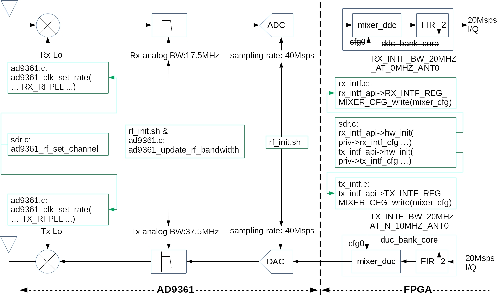
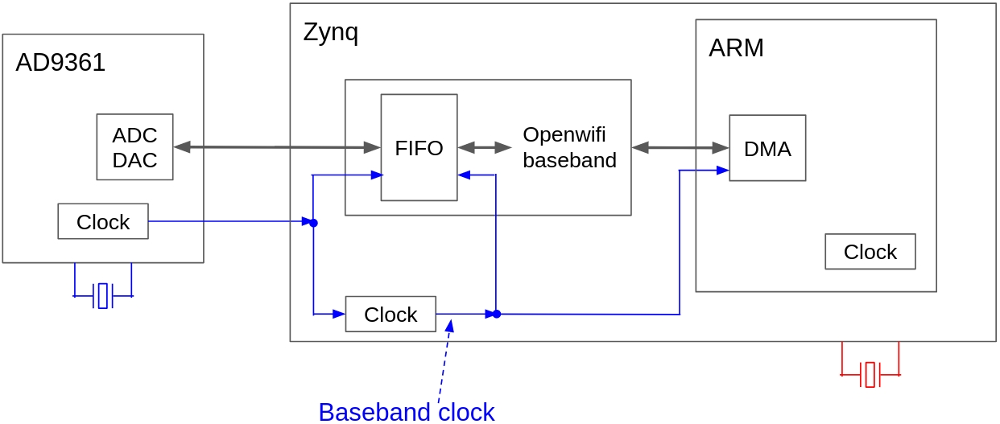

<!--
Author: Xianjun jiao, Michael Mehari, Wei Liu
SPDX-FileCopyrightText: 2019 UGent
SPDX-License-Identifier: AGPL-3.0-or-later
-->


# Openwifi document


Above figure shows software and hardware/FPGA modules that compose the openwifi design. The module name is equal/similar to the source code file name. Driver module source codes are in openwifi/driver/. FPGA module source codes are in openwifi-hw repository. The user space tool sdrctl source code are in openwifi/user_space/sdrctl_src/. [Sysfs](https://man7.org/linux/man-pages/man5/sysfs.5.html) is another channel that is offered to do userspace-driver communication by mapping driver variables to virtual files. Check [this app note](app_notes/driver_stat.md#Sysfs-explanation) for further explanation.

- [Driver and software overall principle](#Driver-and-software-overall-principle)
- [sdrctl command](#sdrctl-command)
- [Rx packet flow and filtering config](#Rx-packet-flow-and-filtering-config)
- [Tx packet flow and config](#Tx-packet-flow-and-config)
- [Understand the timestamp of WiFi packet](#Understand-the-timestamp-of-WiFi-packet)
- [Regulation and channel config](#Regulation-and-channel-config)
- [Analog and digital frequency design](#Analog-and-digital-frequency-design)
- [Debug methods](#Debug-methods)
- [Test mode driver](#Test-mode-driver)
- [Application notes](app_notes/README.md)

## Driver and software overall principle

[Linux mac80211 subsystem](https://www.kernel.org/doc/html/v4.16/driver-api/80211/mac80211.html), as a part of [Linux wireless](https://wireless.wiki.kernel.org/en/developers/documentation/mac80211), defines a set of APIs ([ieee80211_ops](https://www.kernel.org/doc/html/v4.9/80211/mac80211.html#c.ieee80211_ops)) to rule the Wi-Fi chip driver behavior. SoftMAC Wi-Fi chip driver implements (subset of) those APIs. That is why Linux can support so many Wi-Fi chips of different chip vendors. Different mode (AP/Client/ad-hoc/mesh) might need different set of APIs

openwifi driver (sdr.c) implements following APIs of ieee80211_ops:
-	**tx**. It is called when upper layer has a packet to send
-	**start**. It is called when NIC up. (ifconfig sdr0 up)
-	**stop**. It is called when NIC down. (ifconfig sdr0 down)
-	**add_interface**. It is called when NIC is created
-	**remove_interface**. It is called when NIC is deleted
-	**config**. It is called when upper layer wants to change channel/frequency (like the scan operation)
-	**set_antenna**. Set/select the tx/rx antenna
-	**get_antenna**. Read the current tx/rx antenna idx/combination
-	**bss_info_changed**. It is called when upper layer believe some BSS parameters need to be changed (BSSID, TX power, beacon interval, etc)
-	**conf_tx**. It is called when upper layer needs to config/change some tx parameters (AIFS, CW_MIN, CW_MAX, TXOP, etc)
-	**prepare_multicast**. It is called when upper layer needs to prepare multicast, currently only a empty function hook is present.
-	**configure_filter**. It is called when upper layer wants to config/change the [frame filtering](#Rx-packet-flow-and-filtering-config) rule in FPGA.
-	**rfkill_poll**. It is called when upper layer wants to know the RF status (ON/OFF).
-	**get_tsf**. It is called when upper layer wants to get 64bit FPGA timer value (TSF - Timing synchronization function) 
-	**set_tsf**. It is called when upper layer wants to set 64bit FPGA timer value
-	**reset_tsf**. It is called when upper layer wants to reset 64bit FPGA timer value
-	**set_rts_threshold**. It is called when upper layer wants to change the threshold (packet length) for turning on RTS mechanism
-	**ampdu_action**. AMPDU (Aggregated Mac PDU) related operations
-	**testmode_cmd**. It is called when upper layer has test command for us. [sdrctl command](#sdrctl-command) message is handled by this function.

Above APIs are called by upper layer (Linux mac80211 subsystem). When they are called, the driver (sdr.c) will do necessary job via openwifi FPGA implementation. If necessary, the driver will call other component drivers, like tx_intf_api/rx_intf_api/openofdm_tx_api/openofdm_rx_api/xpu_api, for help.

After receiving a packet from the air, FPGA will raise interrupt (if the frame filtering rule allows) to Linux, then the function openwifi_rx_interrupt() of openwifi driver (sdr.c) will be triggered. In that function, ieee80211_rx_irqsafe() API is used to give the packet and related information (timestamp, rssi, etc) to upper layer.

The packet sending is initiated by upper layer towards openwifi driver. After the packet is sent by the driver over FPGA to the air, the upper layer will expect a sending report from the driver. Each time FPGA sends a packet, an interrupt will be raised to Linux and trigger openwifi_tx_interrupt(). This function will report the sending result (failed? succeeded? number of retransmissions, etc.) to upper layer via ieee80211_tx_status_irqsafe() API.

## sdrctl command

Besides the Linux native Wi-Fi control programs, such as ifconfig/iw/iwconfig/iwlist/wpa_supplicant/hostapd/etc, openwifi offers a user space tool sdrctl to access openwifi specific functionalities, such as time sharing of the interface between two network slices, arbitrary Tx/Rx frequency, Tx attenuation, etc. you may find more details of the slicing mechanism [here](https://doc.ilabt.imec.be/ilabt/wilab/tutorials/openwifi.html#sdr-tx-time-slicing).

sdrctl is implemented as nl80211 testmode command and communicates with openwifi driver (function openwifi_testmode_cmd() in sdrctl_intf.c) via Linux nl80211--cfg80211--mac80211 path 

### Get and set a parameter
```
sdrctl dev sdr0 get para_name
sdrctl dev sdr0 set para_name value 
```
para_name|meaning|comment
---------|-------|----
slice_idx|the slice that will be set/get|0 to 3. After finishing all slice config, **set slice_idx to 4** to synchronize all slices. Otherwise the start/end of different slices have different actual time
addr|target MAC address of tx slice_idx|32bit. for address 6c:fd:b9:4c:b1:c1, you set b94cb1c1
slice_total|tx slice_idx cycle length in us|for length 50ms, you set 49999
slice_start|tx slice_idx cycle start time in us|for start at 10ms, you set 10000
slice_end|  tx slice_idx cycle end   time in us|for end   at 40ms, you set 39999
tsf| sets TSF value| it requires two values "high_TSF low_TSF". Decimal

### Get and set a register of a module
```
sdrctl dev sdr0 get reg module_name reg_idx
sdrctl dev sdr0 set reg module_name reg_idx reg_value 
```
module_name **drv_rx**/**drv_tx**/**drv_xpu**/**rf** refers to the corresponding driver functionality. Related registers are defined in sdr.h. Search drv_rx_reg_val/drv_tx_reg_val/drv_xpu_reg_val/rf_reg_val to see their functionalities.

module_name **rx_intf**/**tx_intf**/**rx**/**tx**/**xpu** FPGA modules (rx_intf/tx_intf/openofdm_rx/openofdm_tx/xpu). Related register addresses are defined in hw_def.h and mapped to slv_regX in .v file (X is the register index). Check rx_intf/tx_intf/openofdm_rx/openofdm_tx/xpu.c and .v files to see their functionalities.

module name **rf** refers to RF (ad9xxx front-end). The agent register rf_reg_val is defined in sdr.h.

Please be aware that some registers are set by driver in real-time (instructed by Linux mac80211), so be careful when set them manually.

module_name: **drv_rx** (for full list, search drv_rx_reg_val in sdr.c)

reg_idx|meaning|comment
-------|-------|----
0|receiver action threshold|receiver will not react (short preamble search and further) if the signal strength is less than this threshold. N means -NdBm
4|rx antenna selection|0:rx1, 1:rx2
7|dmesg print control|please check Debug methods section in this page

(In the **comment** column, you may get a list of **decimalvalue(0xhexvalue):explanation** for a register, only use the **decimalvalue** in the sdrctl command)

module_name: **drv_tx** (for full list, search drv_tx_reg_val in sdr.c)

reg_idx|meaning|comment
-------|-------|----
0|override Linux rate control of non-ht TX unicast data packet|0:auto by Linux, 4:6M, 5:9M, 6:12M, 7:18M, 8:24M, 9:36M, 10:48M, 11:54M
1|override Linux rate control of ht TX unicast data packet|0:auto by Linux, 4:6.5M, 5:13M, 6:19.5M,7:26M, 8:39M, 9:52M, 10:58.5M, 11:65M (add 16 to these values for short GI rate)
2|override Linux rate control of vht (11ac)|not implemented yet
3|override Linux rate control of he (11ax)|not implemented yet
4|tx antenna selection|0:tx1, 1:tx2
7|dmesg print control|please check Debug methods section in this page

module_name: **drv_xpu** (for full list, search drv_xpu_reg_val in sdr.c)

reg_idx|meaning|comment
-------|-------|----
0|LBT/CCA threshold|0: automatic threshold by ad9361_rf_set_channel(). others -- N means -NdBm fixed threshold
7|git revision when build the driver|return the git revision in hex format

module_name: **rf**

reg_idx|meaning|comment
-------|-------|----
0|TX attenuation in dB\*1000|example: set to 3000 for 3dB attenuation
1|TX frequency in MHz|example: set to 5000 for 5GHz -- override Linux channenl tuning/control
5|RX frequency in MHz|example: set to 4000 for 4GHz -- override Linux channenl tuning/control

module_name: **rx_intf** (for full list, check rx_intf.c and **slv_reg** in rx_intf.v)

reg_idx|meaning|comment
-------|-------|----
0|reset|each bit is connected to rx_intf.v internal sub-module. 1 -- reset; 0 -- normal
1|trigger for ILA debug|bit4 and bit0. Please check slv_reg1 in rx_intf.v
2|enable/disable rx interrupt|256(0x100):disable, 0:enable
3|get loopback I/Q from tx_intf|256(0x100):from tx_intf, 0:from ad9361 ADC
4|baseband clock and IQ fifo in/out control|no use anymore -- for old bb rf independent mode
5|control/config dma to cpu|check rx_intf.v slv_reg5
6|abnormal packet length threshold|bit31-16 to store the threshold. if the packet length is not in the range of 14 to threshold, terminate the dma to cpu
7|source selection of rx dma to cpu|check rx_intf.v slv_reg7
8|reserved|reserved
9|number of dma symbol to cpu|only valid in manual mode (slv_reg5[5]==1). normally the dma is set automatically by the received packet length
10|rx adc fifo reading control|check rx_intf.v slv_reg10
11|rx digital I/Q gain|number of bit shift to left. default 4 in rx_intf.c: rx_intf_api->RX_INTF_REG_BB_GAIN_write(4)
12|timeout/reset control of dma to cpu|check rx_intf.v slv_reg12
13|delay from RX DMA complete to RX packet interrupt to cpu|unit 0.1us
16|rx antenna selection|0:ant0, 1:ant1. default 0

module_name: **tx_intf** (for full list, check tx_intf.c and **slv_reg** in tx_intf.v)

reg_idx|meaning|comment
-------|-------|----
0|reset|each bit is connected to tx_intf.v internal sub-module. 1 -- reset; 0 -- normal
1|DUC config or tx arbitrary IQ write port|DUC is removed already. Now it is used to write arbitrary IQ to tx_intf for test purpose
2|phy tx auto start config|check tx_intf.v slv_reg2
4|CTS to Self config|auto set by cts_reg in openwifi_tx of sdr.c. bit31: enable/disable, bit30: rate selection: 1: use traffic rate, 0: manual rate in bit7-4, bit23-8: duration field
5|csi fuzzer config|check CSI fuzzer app note
6|CTS to Self sending delay (for SIFS)|unit 0.1us. bit13-0 for 2.4GHz, bit29-16 for 5GHz
7|tx arbitrary IQ config|check tx_intf.v slv_reg7
8|tx config per packet|automatically set per packet in openwifi_tx() via tx_intf_api->TX_INTF_REG_TX_CONFIG_write(tx_config)
9|reserved|reserved
10|dac input and dma control|check tx_intf.v slv_reg10
11|threshold for FPGA fifo almost full|driver(sdr.c) read 1bit flag in slv_reg21 (4bit in total for 4 queue) to know the FPGA fifo/queue is almost full.
12|threshold to pause openofdm_tx|unit: number of sample. back pressure flow control for I/Q generation speed of openofdm_tx
13|tx I/Q digital gain before dac|find the optimal value (and test record) in tx_intf.c: tx_intf_api->TX_INTF_REG_BB_GAIN_write
14|tx interrupt config|196612(0x30004):disable, 4:enable. check tx_intv.v slv_reg14
15|ampdu action config|set automatically in driver (sdr.c) by openwifi_ampdu_action()
16|tx antenna selection and cdd control|bit1: 0 or 1 to select ant0 or 1. bit4: 1 to enable simple cdd (two antennas have 1 sample tx delay)
17|phy config per packet|aggregation/rate/GI/ht/non-ht/etc. automatically set by driver tx_intf_api->TX_INTF_REG_PHY_HDR_CONFIG_write(phy_hdr_config)
21|queue almost full flag|4bit for 4 queue. criteria is the threshold in slv_reg11. check by tx_intf_api->TX_INTF_REG_S_AXIS_FIFO_NO_ROOM_read() in sdr.c
22|tx status0 per pkt sent|cw,num_slot_random,linux_prio,tx_queue_idx,bd_wr_idx,num_retrans -- per pkt info read by tx interrupt after the pkt sent
23|tx status1 per pkt sent|blk_ack_resp_ssn, pkt_cnt -- per pkt info read by tx interrupt after the pkt sent
24|tx status2 per pkt sent|blk_ack_bitmap_low -- per pkt info read by tx interrupt after the pkt sent
25|tx status3 per pkt sent|blk_ack_bitmap_high -- per pkt info read by tx interrupt after the pkt sent
26|FPGA tx queue runtime length|bit6-0: queue0; bit14-8: queue1; bit22-16: queue2; bit30-24: queue3

module_name: **rx** (for full list, check openofdm_rx.c and **slv_reg** in openofdm_rx.v)

reg_idx|meaning|comment
-------|-------|----
0|reset|each bit is connected to openofdm_rx.v internal sub-module. 1 -- reset; 0 -- normal
1|misc settings|bit0: 1--force smoothing; 0--auto by ht header. bit4: 1--disable all smoothing; 0--let bit0 decide. bit8: 0--high sensitivity sync short; 1--less fake sync short. bit12: 0--watchdog runs regardless power trigger; 1--runs only when power trigger. bit13: 0--watchdog runs regardless state; 1--runs only when state <= S_DECODE_SIGNAL. bit16: 0--enable watchdog eq monitor; 1--disable eq monitor
2|power trigger and dc detection threshold|bit10-0: signal level below this threshold won't trigger demodulation. the unit is rssi_half_db, check rssi_half_db_to_rssi_dbm()/rssi_dbm_to_rssi_half_db() in sdr.c to see the relation to rssi dBm. bit23-16: threshold to prevent dc (or low frequency interference) triggered demodulation
3|minimum plateau used for short preamble detection|initialized by openofdm_rx.c: openofdm_rx_api->OPENOFDM_RX_REG_MIN_PLATEAU_write
4|soft decoding flag and abnormal packet length threshold|bit0 for soft decoding: 0--hard; 1--soft. bit31-16: if the packet length is longer this threshold, terminate demodulation. bit15-12: minimum packet length threshold to terminate demodulation
5|fft_win_shift and small eq monitor threshold|bit3-0: fft window shift (default 4). bit9-4: threshold of how many very small eq out is counted to decide whether reset receiver
17|selector for watchdog event counter|0--phase_offset(sync_short) too big. 1--too many eq out small values. 2--dc is detected (threshold slv_reg2[23:16]). 3--packet too short. 4--packet too long.
18|sync_short phase_offset (frequency offset) threshold|watchdog will reset receiver if phase_offset is above the threshold
19|sync_short phase_offset override|bit31: 1--enable override; 0--disable. bit15-0: value to be set (SIGNED value!)
20|history of PHY rx state|read only. If the last digit readback is always 3, it means the Viterbi decoder stops working
21|read back Fc_in_MHz and sync_short phase_offset|bit31-16: Fc_in_MHz. bit15-0: phase_offset
30|read back watchdog event counter(selected by reg 17)|write to this register, the event counter (selected by reg 17) will be cleared
31|git revision when build the receiver|returned register value means git revision in hex format

module_name: **tx** (for full list, check openofdm_tx.c and **slv_reg** in openofdm_tx.v)

reg_idx|meaning|comment
-------|-------|----
0|reset|each bit is connected to openofdm_tx.v internal sub-module. 1 -- reset; 0 -- normal
1|pilot scrambler initial state|lowest 7 bits are used. 127(0x7F) by default in openofdm_tx.c
2|data  scrambler initial state|lowest 7 bits are used. 127(0x7F) by default in openofdm_tx.c
20|reserved|reserved

module_name: **xpu** (for full list, check xpu.c and **slv_reg** in xpu.v)

reg_idx|meaning|comment
-------|-------|----
0|reset|each bit is connected to xpu.v internal sub-module. 1 -- reset; 0 -- normal
1|rx packet and I/Q config when tx|bit0 0: auto control (auto self-rx-IQ-mute when tx), 1:manual control by bit31 (1 self-IQ-mute; 0 unmute). bit2 0: rx packet filtering is configured by Linux, 1: no rx packet filtering, send all to Linux
2|TSF timer low  32bit write|only write this register won't trigger the TSF timer reload. should use together with register for high 31bit
3|TSF timer high 31bit write|falling edge of register MSB will trigger the TSF timer reload, which means write '1' then '0' to bit31 (bit30-0 for TSF)
4|band, channel and ERP short slot setting|for CSMA engine config. set automatically by Linux. manual set could be overrided unless you change sdr.c. Channel means frequency in MHz
5|DIFS and backoff advance (us), abnormal pkt length threshold|advance (us) for tx preparation before the end of DIFS/backoff. bit7-0:DIFS advance, bit15-8: backoff advance. bit31-16: if the packet length is not in the range of 14 to this threshold, terminate pkt filtering procedure
6|multi purpose CSMA settings|bit7-0: forced channel idle (us) after decoding done to avoid false alarm caused by strong "AGC tail" signal. bit31: NAV disable, bit30: DIFS disable, bit29: EIFS disable, bit28: dynamic CW disable (when disable, CW is taken from bit19-16). (value 1 -- forced disable; 0 -- normal/enable)
7|RSSI and ad9361 gpio/gain delay setting (sync with IQ rssi)|bit26-16: offset for rssi report to Linux; bit6-0 delay (number of sample) of ad9361 gpio/gain to sync with IQ sample rssi/amplitude
8|RSSI threshold for CCA (channel idle/busy)|set by ad9361_rf_set_channel automatically. the unit is rssi_half_db, check rssi_half_db_to_rssi_dbm()/rssi_dbm_to_rssi_half_db() in sdr.c to see the relation to rssi dBm
9|some low MAC time setting|bit31 0:auto, 1:manual. When manual, bit6-0: PHY rx delay, bit13-7: SIFS, bit18-14: slot time, bit23-19: ofdm symbol time, bit30-24: preamble+SIG time. unit us. check xpu.v (search slv_reg9)
10|BB RF delay setting|unit 0.1us. bit7-0: BB RF delay, bit14-8: RF end extended time on top of the delay. bit22-16: delay between bb tx start to RF tx on (lo or port control via spi). bit30-24: delay between bb tx end to RF tx off. check xpu.v (search slv_reg10)
11|ACK control and max num retransmission|bit4: 0:normal ACK tx/reply, 1:disable auto ACK tx/reply in FPGA. bit5: 0:normal ACK rx from peer, 1:not expecting ACK rx from peer. bit3-0: if bit3==0, the number of retransmission is decided by Linux. if bit3==1, the max num retransmission is taken from bit2-0
12|AMPDU control|bit0: indicate low MAC start to receive AMPDU. bit4-1: tid. bit31: tid enable (by default, tid is not enabled and we decode AMPDU of all tid)
13|spi controller config|1: disable spi control and Tx RF is always on; 0: enable spi control and Tx RF only on (lo/port) when pkt sending
16|setting when wait for ACK in 2.4GHz|unit 0.1us. bit14-0: OFDM decoding timeout (after detect PHY header), bit30-16: timeout for PHY header detection, bit31: 0: FCS valid is not needed for ACK packet, 1: FCS valid is needed for ACK packet
17|setting when wait for ACK in 5GHz|unit 0.1us. bit14-0: OFDM decoding timeout (after detect PHY header), bit30-16: timeout for PHY header detection, bit31: 0: FCS valid is not needed for ACK packet, 1: FCS valid is needed for ACK packet
18|setting for sending ACK|unit 0.1us. bit14-0: ACK sending delay in 2.4GHz, bit30-16: ACK sending delay in 5GHz
19|CW min and max setting for 4 FPGA queues|bit3-0: CW min for queue 0, bit7-4: CW max for queue 0, bit11-8: CW min for queue 1, bit15-12: CW max for queue 1, bit19-16: CW min for queue 2, bit23-20: CW max for queue 2, bit27-24: CW min for queue 3, bit31-28: CW max for queue 3. automatically decided by Linux via openwifi_conf_tx of sdr.c
20|slice/queue-tx-gate total cycle length|bit21-20: queue selection. bit19-0: total cycle length in us
21|slice/queue-tx-gate start time in the cycle|bit21-20: queue selection. bit19-0: start time in us
22|slice/queue-tx-gate end time in the cycle|bit21-20: queue selection. bit19-0: end time in us
26|CTS to RTS setting|bit15-0: extra duration, bit20-16: rate/MCS, bit31: 0:enable CTStoRTS 1:disable CTStoRTS
27|FPGA packet filter config|bit13-0 passing/filter config. bit24-16 dropping config. check openwifi_configure_filter in sdr.c. also [mac80211 frame filtering](https://www.kernel.org/doc/html/v4.9/80211/mac80211.html#frame-filtering)
28|BSSID address low  32bit for BSSID filtering|auto set by xpu_api->XPU_REG_BSSID_FILTER_LOW_write in openwifi_bss_info_changed of sdr.c
29|BSSID address high 16bit for BSSID filtering|auto set by xpu_api->XPU_REG_BSSID_FILTER_HIGH_write in openwifi_bss_info_changed of sdr.c
30|MAC address low  32bit|auto set by XPU_REG_MAC_ADDR_write in sdr.c
31|MAC address high 16bit|auto set by XPU_REG_MAC_ADDR_write in sdr.c
57|rssi_half_db read back together with channel idle and other CSMA states|Check slv_reg57 in xpu.v. Use rssi_openwifi_show.sh and rssi_ad9361_show.sh together for RSSI checking.
58|TSF runtime value low  32bit|read only
59|TSF runtime value high 32bit|read only
62|addr2 of rx packet read back|bit31-0 are from bit47-16 of addr2 field in the received packet
63|git revision when build the FPGA|returned register value means git revision in hex format

## Rx packet flow and filtering config

After FPGA receives a packet, no matter the FCS/CRC is correct or not it will raise interrupt to Linux if the frame filtering rule allows (See also [mac80211 frame filtering](https://www.kernel.org/doc/html/v4.9/80211/mac80211.html#frame-filtering)). openwifi_rx_interrupt() function in sdr.c serves the interrupt and gives the necessary information to upper layer (Linux mac80211 subsystem) via ieee80211_rx_irqsafe.

- frame filtering

The FPGA frame filtering configuration is done by function openwifi_configure_filter() in sdr.c. The filter_flag together with **HIGH_PRIORITY_DISCARD_FLAG** finally go to pkt_filter_ctl.v of xpu module in FPGA, and control how FPGA does frame filtering. Openwifi has the capability to capture all received packets even if the CRC is wrong. You just need to set the NIC to monitor mode by iwconfig command (check monitor_ch.sh in user_space directory). In monitor mode, all received packets (including control packet, like ACK) will be given to Linux mac80211. 

- main rx interrupt operations in openwifi_rx_interrupt()
  - get raw content from DMA buffer. When Linux receives interrupt from FPGA rx_intf module, the content has been ready in Linux DMA buffer
  - parse extra information inserted by FPGA in the DMA buffer
    - TSF timer value
    - raw RSSI value that will be converted to actual RSSI in dBm by different correction in different bands/channels
    - packet length and MCS
    - FCS is valid or not
  - send packet pointer (skb) and necessary extra information to upper layer via ieee80211_rx_irqsafe()

## Tx packet flow and config

Linux mac80211 subsystem calls openwifi_tx() to initiate a packet sending. 

- main operations in openwifi_tx()
  - get necessary information from the packet header (struct ieee80211_hdr) for future FPGA configuration
    - packet length and MCS
    - unicast or broadcast? does it need ACK? how many retransmissions at most are allowed to be tried by FPGA in case ACK is not received in time?
    - which driver-ring/queue (time slice) in FPGA the packet should go?
    - should RTS-CTS be used? (Send RTS and wait for CTS before actually send the data packet)
    - should CTS-to-self be used? (Send CTS-to-self packet before sending the data packet. You can force this on by force_use_cts_protect = true;)
    - should a sequence number be inserted to the packet at the driver/chip level?
  - maintain sequence number (ring->bd_wr_idx) for internal use (cross check between FPGA, openwifi_tx and openwifi_tx_interrupt)
  - config FPGA register according to the above information to help FPGA do correct actions (generate PHY header, etc) according to the packet specific requirement.
  - fire DMA transmission from Linux to one of FPGA tx queues. The packet may not be sent immediately if there are still some packets in FPGA tx queue (FPGA does the queue packet transmission according to channel and low MAC CSMA state)
    
Each time when FPGA sends a packet, an interrupt will be raised to Linux reporting the packet sending result. This interrupt handler is openwifi_tx_interrupt().

- main operations in openwifi_tx_interrupt()
  - get necessary information/status of the packet just sent by FPGA
    - packet length and sequence number to capture abnormal situation (cross checking between FPGA, openwifi_tx and openwifi_tx_interrupt)
    - packet sending result: packet is sent successfully (FPGA receives ACK for this packet) or not. How many retransmissions have been done (in case FPGA doesn't receive ACK in time, FPGA will do retransmission according to CSMA/CA low MAC state)
  - send above information to upper layer (Linux mac80211 subsystem) via ieee80211_tx_status_irqsafe()

## Understand the timestamp of WiFi packet

The TSF timestamp shown in the usual wireshark snapshot is reported by openwifi Linux driver towards Linux mac80211 framework.


This TSF timestamp is attached to the DMA of the received packet in FPGA by reading the TSF timier (defined by 802.11 standard and implemented in FPGA) value while PHY header is received: [FPGA code snip](https://github.com/open-sdr/openwifi-hw/blob/14b1e840591f470ee945844cd3bb51a95d7da09f/ip/rx_intf/src/rx_intf_pl_to_m_axis.v#L201).

Then openwifi driver report this timestamp value (together with the corresponding packet) to Linux via:
https://github.com/open-sdr/openwifi/blob/0ce2e6b86ade2f6164a373b2e98d075eb7eecd9e/driver/sdr.c#L530

To match the openwifi side channel collected data (CSI, IQ sample, etc.) to the TSF timestamp of the packet, please check: https://github.com/open-sdr/openwifi/discussions/344

## Regulation and channel config

SDR is a powerful tool for research. It is the user's responsibility to align with local spectrum regulation when doing OTA (Over The Air) test, or do the test via cable (conducted test), or in a chamber to avoid any potential interference.

This section explains how openwifi config the frequency/channel range and change it driven by Linux. The frequency overriding method is also offered by openwifi to allow the system working in any frequency in 70MHz-6GHz.

### Frequency range

When openwifi driver is loaded, openwifi_dev_probe() will be executed. Following two lines configure the frequency range:
```
dev->wiphy->regulatory_flags = xxx
wiphy_apply_custom_regulatory(dev->wiphy, &sdr_regd);
```
sdr_regd is the predefined variable in sdr.h. You can search the definition/meaning of its type: struct ieee80211_regdomain. 

### Supported channel

The supported channel list is defined in openwifi_2GHz_channels and openwifi_5GHz_channels in sdr.h. If you change the number of supported channels, make sure you also change the frequency range in sdr_regd accordingly and also array size of the following two fields in the struct openwifi_priv:
```
struct ieee80211_channel channels_2GHz[14];
struct ieee80211_channel channels_5GHz[53];
```
Finally, the supported channel list is transferred to Linux mac80211 when openwifi driver is loaded by following two lines in openwifi_dev_probe():
```
dev->wiphy->bands[NL80211_BAND_2GHZ] = &(priv->band_2GHz);
dev->wiphy->bands[NL80211_BAND_5GHZ] = &(priv->band_5GHz);
```

### Real-time channel setting and restrict the channel

Linux mac80211 (struct ieee80211_ops openwifi_ops in sdr.c) uses the "config" API to configure channel frequency and some other parameters in real-time (such as during scanning or channel setting by iwconfig). It is hooked to openwifi_config() in sdr.c, and supports only frequency setting currently. The real execution of frequency setting falls to ad9361_rf_set_channel() via the "set_chan" field of struct openwifi_rf_ops ad9361_rf_ops in sdr.c. Besides tuning RF front-end (AD9361), the ad9361_rf_set_channel() also handles AD9361 calibration (if the tuning step size >= 100MHz), RSSI compensation for different frequencies and FPGA configurations (SIFS, etc) for different bands.

If you don't want openwifi node to change the channel anymore (even the Linux asks to do so), use the script user_space/set_restrict_freq.sh to limit the frequency.
```
./set_restrict_freq abcd
```
Above will limit the frequency to abcdMHz. For instance, after you setup the working system in channel 44 and you don't want the node to tune to other channel (occasionally driven by Linux scanning for example), input 5220 as argument to the script.
```
./set_restrict_freq 0
```
Above will remove the limitation. Linux driven channel tuning will be recovered.

### Let openwifi work at arbitrary frequency

Before setting a non-standard frequency to the system, a normal working system should be setup in normal/legal WiFi frequency, which should be as close as possible to the target non-standard frequency. Then use **set_restrict_freq.sh** (see above) to force upper layer to stay at that normal WiFi frequency (no scanning anymore). After this, you can set actual RF frequency to any frequency in 70MHz-6GHz (without notifying upper layer).
```
./sdrctl dev sdr0 set reg rf 1 3500 
```
Above will set the Tx frequency to 3.5GHz.

```
./sdrctl dev sdr0 set reg rf 5 3500 
```
Above will set the Rx frequency to 3.5GHz.

## Analog and digital frequency design

Openwifi has adopted a new RF/baseband frequency and sampling design instead of the original "offset tuning" to achieve better EVM, spectrum mask conformance, sensitivity and RSSI measurement accuracy. The AD9361 is set to FDD working mode with the same Tx and Rx frequency. Realtime AD9361 Tx chain control is done via FPGA SPI interface (openwifi-hw/ip/xpu/src/spi.v) to achieve self-interference free (when Rx) and fast Tx/Rx turn around time (0.6us). The AD9361 Tx lo (local oscillator) or RF switch is turned on before the Tx packet and turned off after the Tx packet. so that there isn't any Tx lo noise leakage during Rx period. The IQ sampling rate between AD9361 and FPGA is 40Msps. It is converted to 20Msps via decimation/interpolation inside FPGA to WiFi baseband transceiver.

Following figure shows the detailed configuration point in AD9361, driver (.c file) and related FPGA modules (.v file).


The openwifi FPGA baseband clock is driven by AD9361 clock, so there won't be any clock drifting/slight-mismatching between RF and baseband as shown in the following picture.


## Debug methods

### dmesg

To debug/see the basic driver behaviour via printk in the sdr.c, you could turn on **dmesg** message printing by 
```
./sdrctl dev sdr0 set reg drv_tx 7 X
./sdrctl dev sdr0 set reg drv_rx 7 X

The bit in value X controls what type of information will be printed to the dmesg (0--no print; 1--print).
bit0: error   message
bit1: regular message for unicast packet (openwifi_tx/openwifi_tx_interrupt/openwifi_rx_interrupt)
bit2: regular message for broadcast packet
bit3: regular queue stop/wake-up message due to too much traffic

For example, regular message for unicast packet and error message
./sdrctl dev sdr0 set reg drv_tx 7 3
./sdrctl dev sdr0 set reg drv_rx 7 3

For example, error message only:
./sdrctl dev sdr0 set reg drv_tx 7 1
./sdrctl dev sdr0 set reg drv_rx 7 1
```
and use **dmesg** command in Linux to see those messages. Regular printing includes tx/rx packet information when a packet is sent or received. Error printing has WARNING information if something abnormal happens. You can search "printk" in sdr.c to see all the printing points.

### tx printing example
```
sdr,sdr openwifi_tx: 70B RC0 10M FC0040 DI0000 ADDRffffffffffff/6655443322aa/ffffffffffff flag4001201e QoS00 SC20_1 retr1 ack0 prio0 q0 wr19 rd18
```
- printing from sdr driver, openwifi_tx function
- 70B: packet size (length field in SIGNAL)
- RC0: rate of the packet. enum mac80211_rate_control_flags in Linux kernel mac80211.h
- 10M: rate 1Mbps. This 802.11b rate will be converted to 6Mbps, because openwifi supports only OFDM rate.
- FC0040: Frame Control field. Example: FC0208 means type data, subtype data, to DS 0, from DS 1 (a packet from AP to client)
- DI0000: Duration/ID field
- ADDR: address fields addr1/2/3. Target MAC address ffffffffffff (broadcast), source MAC address 6655443322aa (openwifi)
- flag4001201e: flags field from Linux mac80211 struct ieee80211_tx_info (first fragment? need ACK? need sequence number insertion? etc.)
- QoS00: QoS control byte related to the packet (from Linux mac80211)
- SC20_1: sequence number 20 is set to the header of the packet. 1 means that it is set by driver (under request of Linux mac80211)
- retr1: retr1 means no retransmission is needed. retr6 means the maximum number of transmissions for this packet is 6 (set by Linux mac80211)
- ack0: ack0 means the packet doesn't need ACK; ack1 means the packet needs ACK. (set by Linux mac80211)
- prio0: priority queue 0 for this packet (0:VO voice, 1:VI video, 2:BE best effort and 3:BK background). check prio in openwifi_tx() of sdr.c (set by Linux mac80211)
- q0: the packet goes to FPGA queue 0. (You can change the mapping between Linux priority and FPGA queue in sdr.c)
- wr19 rd18: the write/read index of buffer (shared buffer between the active openwifi_tx and background openwifi_tx_interrupt/FPGA)
  
### tx interrupt printing example
```
sdr,sdr openwifi_tx_interrupt: tx_result [nof_retx 1 pass 1] SC20 prio0 q0 wr20 rd19 num_slot0 cw0 hwq len00000000 no_room_flag0
```
- printing from sdr driver, openwifi_tx_interrupt function
- tx_result [nof_retx 1 pass 1]: nof_retx 1 means the total number of transmission is 1. pass 1 indicates ACK is received. (0 means not)
- SC20: sequence number 20
- prio, q, wr, rd: these fields can be interpreted the same way as the print in openwifi_tx function
- num_slot: tells how many slots the CSMA/CA state machine waited until the packet is sent in the last tx attempt
- cw: the exponent of the Contention Window for this packet. 6 means the CW size 64. If the contention phase is never entered, CW is 0
- hwq len: the current FPGA queue length (number of pkt left in the queue).8bit per queue. see tx_intf register 26 in the register table section.
- no_room_flag: the DMA room of FPGA queue is almost run out. 1bit per queue. see tx_intf register 21 in the register table section.

### rx printing example
```
sdr,sdr openwifi_rx: 270B ht0aggr0/0 sgi0 240M FC0080 DI0000 ADDRffffffffffff/00c88b113f5f/00c88b113f5f SC2133 fcs1 buf_idx10 -78dBm
```
- printing from sdr driver, openwifi_rx_interrupt function
- 270B: packet size (length field in SIGNAL)
- ht0: ht0 means 11a/g (legacy); ht1 means 11n (ht)
- aggr0/0: the 1st digit means the packet is from a AMPDU packet (1) or not (0). the 2nd digit means the packet is the last packet of a AMPDU packet (1) or not (0)
- sgi0: 0 means normal GI (Guard Interval); 1 means short GI
- 240M:  rate 24Mbps
- FC0080: Frame Control field. Example: FC0108 means type data, subtype data, to DS 1, from DS 0 (a packet client to openwifi AP)
- DI0000: Duration/ID field
- ADDR: address fields addr1/2/3. Target MAC address ffffffffffff (broadcast), source MAC address 00c88b113f5f
- SC2133: sequence number 2133 from the header of the packet
- fcs1: FCS/CRC is OK. (fcs0 means bad CRC)
- buf_idx10: the rx packet is from DMA buffer with index 10
- -78dBm: signal strength of this received packet (after calibration)

### Native Linux tools

For analysis/debug, many native Linux tools you still could rely on. Such as tcpdump, tshark, etc.

### Debug FPGA

For FPGA itself, FPGA developer could use Xilinx ILA tools to analyze FPGA signals (https://github.com/open-sdr/openwifi-hw/issues/39). Spying on those state machines in xpu/tx_intf/rx_intf would be very helpful for understanding/debugging Wi-Fi low level functionalities.

## Test mode driver

While loading the openwifi driver by "insmod sdr.ko", a test_mode argument can be specified (You can also specify the test_mode value to wgd.sh or fosdem.sh). It will enable some experimental feataures (such as AMPDU aggregation):
```
insmod sdr.ko test_mode=value
```
It is implemented by the global static variable test_mode in sdr.c.

Supported test_mode value definitions:
- bit0: AMPDU/aggregation is ON (1) or OFF (0 -- default OFF)
