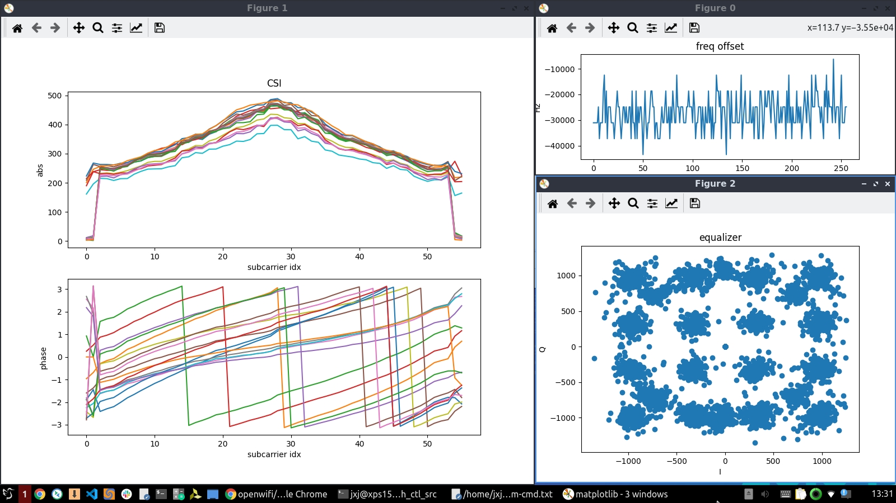
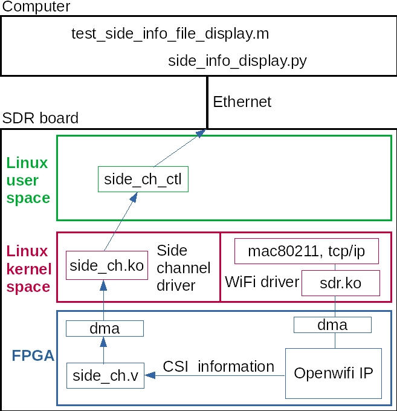
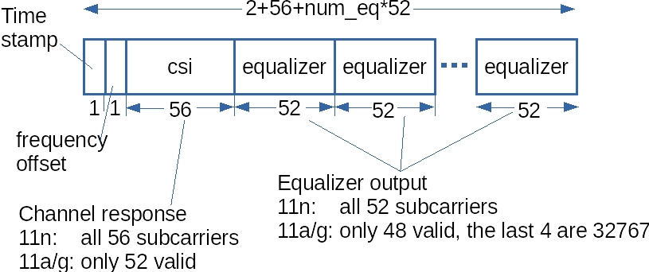

<!--
Author: Xianjun jiao
SPDX-FileCopyrightText: 2019 UGent
SPDX-License-Identifier: AGPL-3.0-or-later
-->


We extend the **CSI** (Channel State Information) to **CSI** (Chip State Information)!

(This app note shows general CSI collection. To use self-Tx CSI in full duplex mode as **RADAR**, please refer to [WiFi CSI radar via self CSI capturing](radar-self-csi.md))

## Quick start
- Power on the SDR board.
- Connect a computer to the SDR board via Ethernet cable. The computer should have static IP 192.168.10.1. Open a terminal on the computer, and then in the terminal:
  ```
  ssh root@192.168.10.122
  (password: openwifi)
  cd openwifi
  ./wgd.sh
  (Wait for the script completed)
  ./monitor_ch.sh sdr0 11
  (Monitor on channel 11. You can change 11 to other channel that is busy)
  insmod side_ch.ko
  ./side_ch_ctl g
  ```
  You should see on board outputs like:
  ```
  loop 64 side info count 61
  loop 128 side info count 99
  ...
  ```
  If the second number (61, 99, ...) is not zero and keeps increasing, that means the CSI (Chip State Information) is going to the computer smoothly.
  
- On your computer (NOT in ssh!), run:
  ```
  cd openwifi/user_space/side_ch_ctl_src
  python3 side_info_display.py
  ```
  You might need to install beforehand: "sudo apt install python3-numpy python3-matplotlib python3-tk". Now you should see 3 figures showing run-time **frequency offset**, **channel state/response** and **constellation form equalizer**. Meanwhile the python script prints the **timestamp**.
  
  
  While running, all information is also stored into a file **side_info.txt**. A matlab script **test_side_info_file_display.m** is offered to help you do analysis on the Chip State Information offline.

## Understand the CSI feature
  The CSI information is extracted via the openwifi **side channel** infrastructure. This figure explains the related modules (also related source code file name) and how the information goes from the SDR board to the computer.
  

  The CSI information format is shown in this figure.
  

  For each element, the actual size is 64bit.
  - timestamp: 64bit TSF timer value, which is the same timestamp value shown by other sniffer software, like tcpdump, wireshark or openwifi printing in dmesg.
  - freq_offset: Only the 1st 16bit is used.
  - csi (channel state/response) and equalizer: Only the first two 16bit are used for I/Q of channel response and equalizer output. The remaining two 16bit are reserved for future multi-antenna cases.
  
  The python and Matlab scripts are recommended for you to understand the CSI packet format precisely.

## Config the capture condition and interval
  The quick start guide will monitor all CSI information of all packets decoded by the WiFi ofdm receiver. To monitor only specific packets that match the specific conditions: FC (Frame Control), addr1 (target MAC address), addr2 (source MAC address), configuration command should be issued before executing "**side_ch_ctl g**". The configuration command is realized by feeding a different parameter to "**side_ch_ctl**". 
  
  A quick example: Capture only CSI of those packets from the device with MAC address 56:5b:01:ec:e2:8f
  ```
  ./side_ch_ctl wh1h4001
  ./side_ch_ctl wh7h01ece28f
  (01ece28f are the last 32 bits of MAC address 56:5b:01:ec:e2:8f)
  ./side_ch_ctl g
  ```
  The parameter string format is explained in detail:
  ```
  whXhY
  ```
  The X is the register index, and the Y is the value in hex format. The remaining "w", "h" and "h" should be kept untouched.
  - To turn on conditional capture, X should be 1. For Y: bit11~bit0 should be 001(hex), bit12: on/off of FC match, bit13: on/off of addr1 match, bit14 : on/off of addr2 match. Examples:
  ```
  Turn on FC only match:
  ./side_ch_ctl wh1h1001
  (1001 is the value in hex format)
  Turn on addr2 (source address) only match:
  ./side_ch_ctl wh1h4001
  
  Turn on both FC and addr1 (target address) match:
  ./side_ch_ctl wh1h3001
  
  Turn off conditional capture (all packets will be captured):
  ./side_ch_ctl wh1h0001
  ```
  - To specify the condition matching target (when that type of match is turned on by above command):
  ```
  Specify the FC matching target:
  ./side_ch_ctl wh5hY
  (Y is the FC value in hex format)
  Specify the addr1 (target address) matching target:
  ./side_ch_ctl wh6hY
  
  Specify the addr2 (source address) matching target:
  ./side_ch_ctl wh7hY
  (Y is the MAC address in hex format. Only the last 32 bits are needed. Example: for 56:5b:01:ec:e2:8f, 01ece28f should be input.)
  ```  
  The command "**side_ch_ctl g**" will perform CSI capture every 100ms until you press ctrl+C. To use a different capture interval:
  ```
  side_ch_ctl gN
  ```
  The interval will become N*1ms

## Config the num_eq
  The num_eq (number of equalizer output) is configurable in case you don't need so many equalizer information. The valid value is 0~8. You should align the num_eq value at the side_ch.ko, side_info_display.py and test_side_info_file_display.m. 
  - When insert the kernel module, use:
  ```
  insmod side_ch.ko num_eq_init=3
  ```
  You can replace 3 by number 0~8. (8 is the default value. You don't need to specify it like in the Quick start section)
  - When launch the python script, use:
  ```
  side_info_display.py 3
  ```
  - When use the Matlab script, please change the num_eq variable in the script to 3 (3 is just an example).

## Compile the side channel driver and user space program
  - side_ch.ko
  ```
  $OPENWIFI_DIR/driver/side_ch/make_driver.sh $OPENWIFI_DIR $XILINX_DIR ARCH_BIT
(For Zynq 7000, ARCH_BIT should be 32, for Zynq MPSoC, ARCH_BIT should be 64)
  ```
  - side_ch_ctl (take user_space/side_ch_ctl_src/side_ch_ctl.c and compile it on board!)
  ```
  gcc -o side_ch_ctl side_ch_ctl.c
  ```

## Run the CSI together with modes other than monitor
  The openwifi CSI feature could run with not only monitor mode but also other modes, such as AP-Client or ad-hoc mode. After the communication functionality is fully up in those modes, you can start CSI feature from "**insmod side_ch.ko**" and "**./side_ch_ctl g**" on board as described in the previous sections to extract CSI to your computer.

## Map the CSI information to the WiFi packet
  Please check this discussion: https://github.com/open-sdr/openwifi/discussions/344
  
  If you want to relate the CSI information to the WiFi packet, you need to capture WiFi packets (tcpdump/wireshark/etc) while capturing CSI. Then you can match the timestamp (TSF timer value) between WiFi packet and CSI information, because this is the unique same identity of a Wifi packet and related CSI information.
  
  Please learn the python and Matlab script to extract CSI information per packet according to your requirement.
