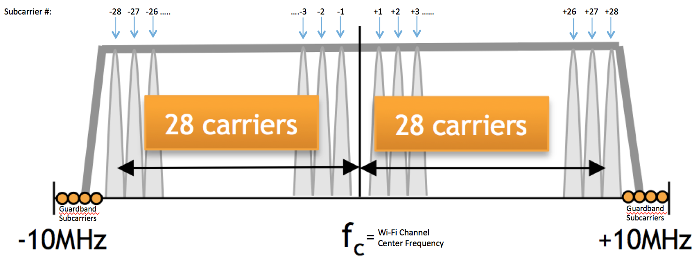
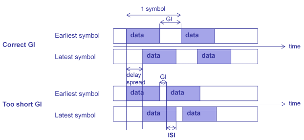
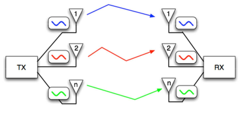
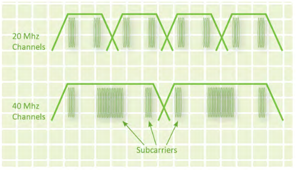
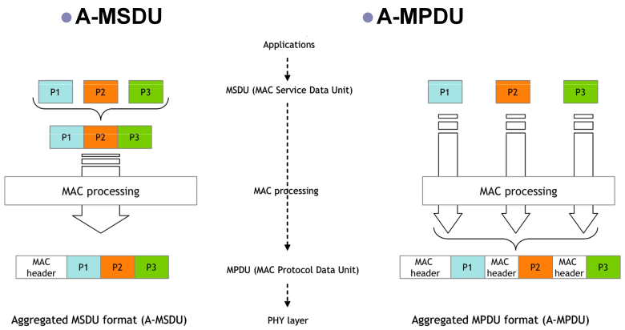

<!--
Author: Michael Mehari
SPDX-FileCopyrightText: 2019 UGent
SPDX-License-Identifier: AGPL-3.0-or-later
-->

## IEEE 802.11n (Wi-Fi 4)

The 4th generation of Wi-Fi (i.e. 802.11n-2009) is a generation leap over its predecessor Wi-Fi 3 (i.e. 802.11g-2003). It was coined as high throughput (HT) since it improves both the physical layer and the MAC layer.

### PHY layer improvements
At the physical layer, 5 major improvements were amended on top of Wi-Fi 3 and this has increased the throughput from 54Mbps to 600Mbps.

#### More subcarriers
Wi-Fi 3 utilizes 48 OFDM data subcarriers and Wi-Fi 4 increased this number to 52, thereby increasing the throughput to 52/48 * 54Mbps = 58.5Mbps.

#### Forward error correction
The most efficient coding rate used in Wi-Fi 3 was 3/4 but Wi-Fi increased this value to 5/6 by squeezing more bits. This has increased the throughput to (5/6)/(3/4) * 58.5Mbps = 65Mbps.

#### Guard interval
As a measure to combat inter-symbol interference (ISA), Wi-Fi 3 utilizes 800nsec of guard interval between consecutive OFDM symbols. Wi-Fi 4 shortens this value to 400nsec, and this has increased the throughput to 4usec/3.6usec * 65Mbps = 72.2Mbps.

#### MIMO
Wi-Fi 4 was the first to introduce MIMO and standardized 4x4 spatial streams. This has quadrupled the throughput to 4*72.2Mbps = 288.9Mbps.

#### 40MHz bandwidth
The last thing Wi-Fi 4 introduced to the physical layer is a 40MHz bandwidth utilizing 108 OFDM data subcarriers. This has increased the throughput to 108/52 * 288.8Mbps = 600 Mbps.

### MAC layer improvements

On top of the PHY layer improvements, Wi-Fi 4 also introduced frame aggregation at the MAC layer to ease the medium access contention. Two types of frame aggregation are used in Wi-Fi 4; A-MPDU and A-MSDU. While A-MSDU is efficient in medium occupation, a single packet error will make the whole frame unusable and require complete retransmission. However, A-MPDU aggregates multiple MPDUs by adding headers to each packet and a single packet error only requires single packet retransmission. As such, A-MPDU gained traction.

## Supported openwifi 802.11n amendments

- 52 subcarriers
- 5/6 code rates
- 400nsec short guard interval.

Current theoretical throughput = 72.2Mbps.

## To be supported openwifi 802.11n amendments
- Frame aggregation

## Not supported openwifi 802.11n amendments

- MIMO
- 40MHz bandwidth
