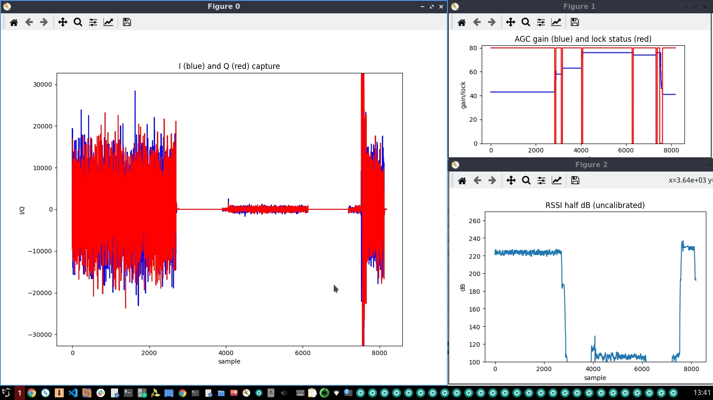
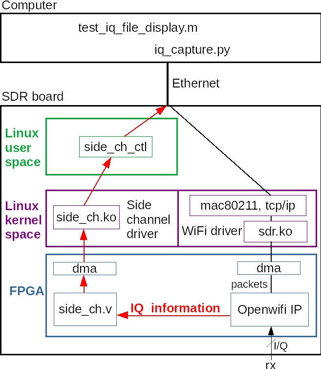
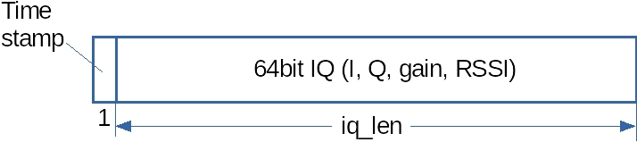
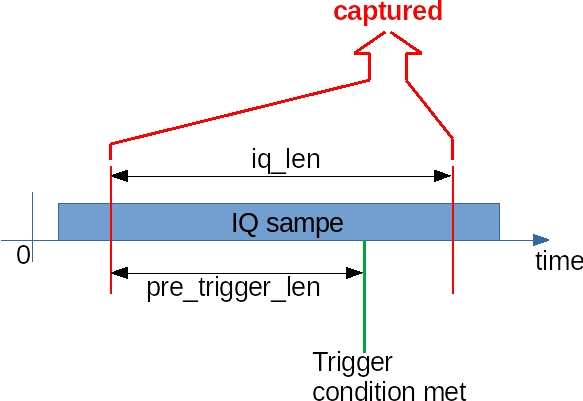

<!--
Author: Xianjun jiao
SPDX-FileCopyrightText: 2019 UGent
SPDX-License-Identifier: AGPL-3.0-or-later
-->


We implement the **IQ sample capture** with interesting extensions: many **trigger conditions**; **RSSI**, RF chip **AGC** **status (lock/unlock)** and **gain**, Frequency offset FPGA vs Actual(floating point python algorithm based on IQ).

(By default, openwifi Rx baseband is muted during self Tx, to unmute Rx baseband and capture self Tx signal you need to run "./sdrctl dev sdr0 set reg xpu 1 1" after the test running)

[[Quick start](#Quick-start)]
[[Understand the IQ capture feature](#Understand-the-IQ-capture-feature)]
[[Config the IQ capture and interval](#Config-the-IQ-capture-and-interval)]
[[Config the iq_len](#Config-the-iq_len)]

[[Examine frequency offset estimation FPGA VS Python](#Examine-frequency-offset-estimation-FPGA-VS-Python)]
[[Calculate SNR based on IQ](#Calculate-SNR-based-on-IQ)]

[[Compile the side channel driver and user space program](#Compile-the-side-channel-driver-and-user-space-program)]
[[Run the IQ capture together with modes other than monitor](#Run-the-IQ-capture-together-with-modes-other-than-monitor)]
[[Map the IQ information to the WiFi packet](#Map-the-IQ-information-to-the-WiFi-packet)]

## Quick start
- Power on the SDR board.
- Connect a computer to the SDR board via Ethernet cable. The computer should have static IP 192.168.10.1. Open a terminal on the computer, and then in the terminal:
  ```
  ssh root@192.168.10.122
  (password: openwifi)
  cd openwifi
  ./wgd.sh
  (Wait for the script completed)
  ./monitor_ch.sh sdr0 11
  (Monitor on channel 11. You can change 11 to other channel that is busy)
  insmod side_ch.ko iq_len_init=8187
  (for smaller FPGA (7Z020), iq_len_init should be <4096, like 4095, instead of 8187)
  
  ./side_ch_ctl wh3h01
  (Enable the IQ capture and configure the IQ data source)

  ./side_ch_ctl wh11d4094
  (Above command is needed only when you run with zed, adrv9364z7020, zc702 board)
  
  ./side_ch_ctl g
  ```
  You should see on board outputs like:
  ```
  loop 64 side info count 61
  loop 128 side info count 99
  ...
  ```
  If the second number (side info count 61, 99, ...) keeps increasing, that means the trigger condition is met from time to time and the IQ sample is going to the computer smoothly.
  
- Open another terminal on the computer, and run:
  ```
  cd openwifi/user_space/side_ch_ctl_src
  python3 iq_capture.py
  (for zed, adrv9364z7020, zc702 board, add argument that euqals to iq_len_init, like 4095)
  ```
  You might need to install beforehand: "sudo apt install python3-numpy python3-matplotlib python3-tk". Now you should see 3 figures showing run-time **IQ sample**, **AGC gain and lock status** and **RSSI (uncalibrated)**. Meanwhile the python script prints the **timestamp**.
  
  
  While running, all information is also stored into a file **iq.txt**. A matlab script **test_iq_file_display.m** is offered to help you do analysis on the IQ Information offline. For zed, adrv9364z7020, zc702 board, do not forget to change the **iq_len** in the matlab script to 4095.

## Understand the IQ capture feature
  The IQ information is extracted via the openwifi **side channel** infrastructure. This figure explains the related modules (also related source code file name) and how the information goes from the SDR board to the computer.
  

  The IQ information format is shown in this figure.
  

  For each element, the actual size is 64bit.
  - timestamp: 64bit TSF timer value when the capture is triggered.
  - IQ
    - The first two 16bit are used for I/Q sample from the antenna currently used
    - The 3rd 16bit is AD9361 AGC gain (bit7 -- lock/unlock; bit6~0 -- gain value)
    - The 4th 16bit is RSSI (half dB, uncalibrated). Please check xpu.v and sdr.c to understand how the raw RSSI value is finally calibrated and reported to Linux mac80211.
    
  The python and Matlab scripts are recommended for you to understand the IQ packet format precisely.

## Config the IQ capture and interval
  The quick start guide captures a period of history IQ when the packet FCS checksum is checked by Wifi receiver (no matter pass or fail). To initiate the capture with different trigger conditions and length, configuration commands should be issued before executing "**side_ch_ctl g**". The configuration command is realized by feeding a different parameter to "**side_ch_ctl**". The main parameters that are configurable are explained in this figure.
  
  
  **iq_len** is the number of IQ samples captured per trigger condition met. The capture is started from the time **pre_trigger_len** IQ samples before the trigger moment. **iq_len** is set only one time when you insert the side_ch.ko. Please check the next section for **iq_len** configuration. This section introduces the setting of pre_trigger_len and trigger condition.
  - pre_trigger_len
  ```
  ./side_ch_ctl wh11dY
  ```
  The parameter **Y** specifies the pre_trigger_len. Valid range 0 ~ 8190. It is limited by the FPGA fifo size. For **small FPGA** (zed_fmcs2, adrv9364z7020, zc702), the valid range is 0 ~ **4094**.
  - trigger condition
  ```
  ./side_ch_ctl wh8dY
  ```
  The parameter **Y** specifies the trigger condition. Valid range 0 ~ 31, which is explained in this table.
  
  value|meaning
  -----|-------
  0 |receiver gives FCS checksum result. no matter pass/fail. Or free run
  1 |receiver gives FCS checksum result. pass
  2 |receiver gives FCS checksum result. fail
  3 |the tx_intf_iq0 becomes non zero (the 1st I/Q out)
  4 |receiver gives SIGNAL field checksum result. pass
  5 |receiver gives SIGNAL field checksum result. fail
  6 |receiver gives SIGNAL field checksum result. no matter pass/fail. HT packet
  7 |receiver gives SIGNAL field checksum result. no matter pass/fail. non-HT packet
  8 |receiver gives  long preamble detected
  9 |receiver gives short preamble detected
  10|RSSI (half dB uncalibrated) goes above the threshold
  11|RSSI (half dB uncalibrated) goes below the threshold
  12|AD9361 AGC from lock to unlock
  13|AD9361 AGC from unlock to lock
  14|AD9361 AGC gain goes above the threshold
  15|AD9361 AGC gain goes below the threshold
  16|tx_control_state_hit when xpu tx_control_state hit the specified value (by side_ch_ctl wh5)
  17|phy_tx_done signal from openofdm tx core
  18|positive edge of tx_bb_is_ongoing from xpu core
  19|negative edge of tx_bb_is_ongoing from xpu core
  20|positive edge of tx_rf_is_ongoing from xpu core
  21|negative edge of tx_rf_is_ongoing from xpu core
  22|phy_tx_started and this tx packet needs ACK
  23|phy_tx_done and this tx packet needs ACK
  24|both tx_control_state and phy_type (0 Legacy; 1 HT; 2 HE) hit (by side_ch_ctl wh5)
  25|addr1 and/or addr2 are matched. Please check the related addr1/2 match config in CSI app note
  26|positive edge of tx_rf_is_ongoing and this tx packet needs ACK
  27|negative edge of tx_rf_is_ongoing and this tx packet needs ACK
  28|tx_bb_is_ongoing and I/Q amplitude from the other antenna is above rssi_or_iq_th
  29|tx_rf_is_ongoing and I/Q amplitude from the other antenna is above rssi_or_iq_th
  30|start tx, meanwhile I/Q amplitude from the other antenna is above rssi_or_iq_th
  31|start tx and need for ACK, meanwhile I/Q amplitude from the other antenna is above rssi_or_iq_th
  
  Hardware register 5 has fields for multi-purpose. bit0 for free running mode. bit7~4 for tx_control_state target value. bit 9~8 for phy_type. For example, set target tx_control_state to SEND_BLK_ACK (3) and phy_type to HE (2):
  ```
  ./side_ch_ctl wh5h230
  ```

  If free running is wanted (alway trigger), please use the following two commands together.
  ```
  ./side_ch_ctl wh8d0
  ./side_ch_ctl wh5d1
  ```
  
  To set the RSSI threshold
  ```
  ./side_ch_ctl wh9dY
  ```
  The parameter **Y** specifies the RSSI threshold. Valid range 0 ~ 2047.
  
  To set the AGC gain threshold
  ```
  ./side_ch_ctl wh10dY
  ```
  The parameter **Y** specifies the AGC gain threshold. Valid range 0 ~ 127.
  
  The command "**side_ch_ctl g**" will perform IQ capture every 100ms until you press ctrl+C. To use a different capture interval:
  ```
  side_ch_ctl gN
  ```
  The interval will become N*1ms

## Examine frequency offset estimation FPGA VS Python
  The script **iq_capture_freq_offset.py** can show the FPGA estimated frequency offset and the actual frequency offset calculated by floating point python algorithm. If they are very different, you could try to override the FPGA frequency estimation module by **user_space/receiver_phase_offset_override.sh** with the result from the python algorithm.

  **DO NOT FORGET** to change **LUT_SIZE** in the **iq_capture_freq_offset.py** if you are testing 80211ax.

  To use the **iq_capture_freq_offset.py**, here is an example command sequence (also available at the beginning of **iq_capture_freq_offset.py**):
  - On board, insert the module with iq length 1500 and set: pre trigger length 1497, the MAC address of the peer, the self MAC address, enable the MAC address match, trigger condition 25 (both addr1 and addr2 match), starting capture.
    ```
    insmod side_ch.ko iq_len_init=1500
    ./side_ch_ctl wh11d1497
    ./side_ch_ctl wh7h635c982f
    ./side_ch_ctl wh6h44332236
    ./side_ch_ctl wh1h6001
    ./side_ch_ctl wh8d25
    ./side_ch_ctl g0
    ```
    In the case of totally clean/non-standard channel, long preamble detected can also be used as trigger condition:
    ```
    insmod side_ch.ko iq_len_init=1500
    ./side_ch_ctl wh11d1497
    ./side_ch_ctl wh8d8
    ./side_ch_ctl g0
    ```
  - On host PC:
    ```
    python3 iq_capture_freq_offset.py 1500
    ```
  It will print phase_offset value (FPGA VS python) in the shell, and plot some real-time figures.

## Calculate SNR based on IQ
  After the IQ is captured and the .mat file has been generated by **test_iq_file_display.m**, **show_iq_snr.m** can be used to calculate the SNR (Signal to Noise Ratio) based on the .mat file in Matlab.

  It is recommended to do this SNR check with single signal/packet source in a very clean (such as cable test in non-standard channels) environment. Otherwise the SNR statistics over variant link status is less meaningful.

  - The 1st step is running with .mat file as the only argument in Matlab:
    ```
    show_iq_snr(mat_file_name)
    ```
    It will show a figure of relative RSSI change (dB). You should decide the middle value which is roughly the middle point between the high RSSI (signal) and low RSSI.
  - The 2nd step is running with .mat file and the middle value as arguments in Matlab:
    ```
    show_iq_snr(mat_file_name, middle_value)
    ```
    It will show the SNR in Matlab command line, and plot the figure with signal and noise regions identified.

## Config the iq_len
  The **iq_len** (number of IQ sample per capture) is configurable in case you want less IQ samples per capture so that it can be triggered more times during a specific analysis period. The valid value is 1~**8187**. For **small FPGA** (zed_fmcs2, adrv9364z7020, zc702), the valid range is 0 ~ **4095**. It is independent from pre_trigger_len, and it can be less than pre_trigger_len if you want. You should align the **iq_len** value at the side_ch.ko, iq_capture.py and test_iq_file_display.m. 
  - When insert the kernel module, use:
  ```
  insmod side_ch.ko iq_len_init=3000
  ```
  Here 3000 is an example. **ATTENTION:** You need to specify **iq_len_init** explicitly to turn on IQ capture, which will turn off the default CSI mode. Insert the side_ch.ko without any parameter will run the default CSI mode.
  - When launch the python script, use:
  ```
  python3 iq_capture.py 3000
  ```
  - When use the matlab script, please change the **iq_len** variable in the script to 3000.

## Compile the side channel driver and user space program
  - side_ch.ko
  ```
  $OPENWIFI_DIR/driver/side_ch/make_driver.sh $OPENWIFI_DIR $XILINX_DIR ARCH_BIT
(For Zynq 7000, ARCH_BIT should be 32, for Zynq MPSoC, ARCH_BIT should be 64)
  ```
  - side_ch_ctl (take user_space/side_ch_ctl_src/side_ch_ctl.c and compile it on board!)
  ```
  gcc -o side_ch_ctl side_ch_ctl.c
  ```

## Run the IQ capture together with modes other than monitor
  The openwifi IQ capture feature could run with not only monitor mode but also other modes, such as AP-Client or ad-hoc mode. After the communication functionality is fully up in those modes, you can start IQ capture from "**insmod side_ch.ko**" and "**./side_ch_ctl g**" on board as described in the previous sections to extract IQ information to your computer.

## Map the IQ information to the WiFi packet
  Recent tutorial: https://github.com/open-sdr/openwifi/discussions/344

  Old text:

  If you want to relate the IQ information to the WiFi packet, you need to capture WiFi packets (tcpdump/wireshark/etc) while capturing IQ. Then you can relate the timestamp between WiFi packet and IQ information. Please be noticed that the timestamp in the IQ information is the moment when capture is triggered, which could be different from the timestamp reported in the packet capture program. But since they share the same time base (TSF timer), you can relate them easily by analyzing the WiFi packet and IQ sample sequence.
  
  Please learn the python and Matlab script to extract IQ information per capture according to your requirement.
