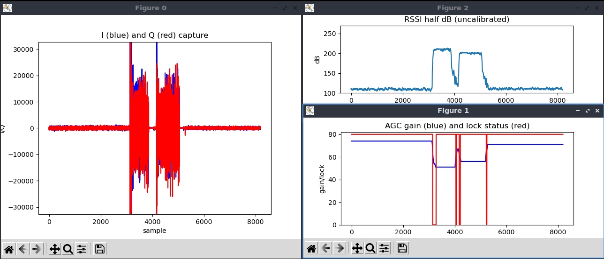
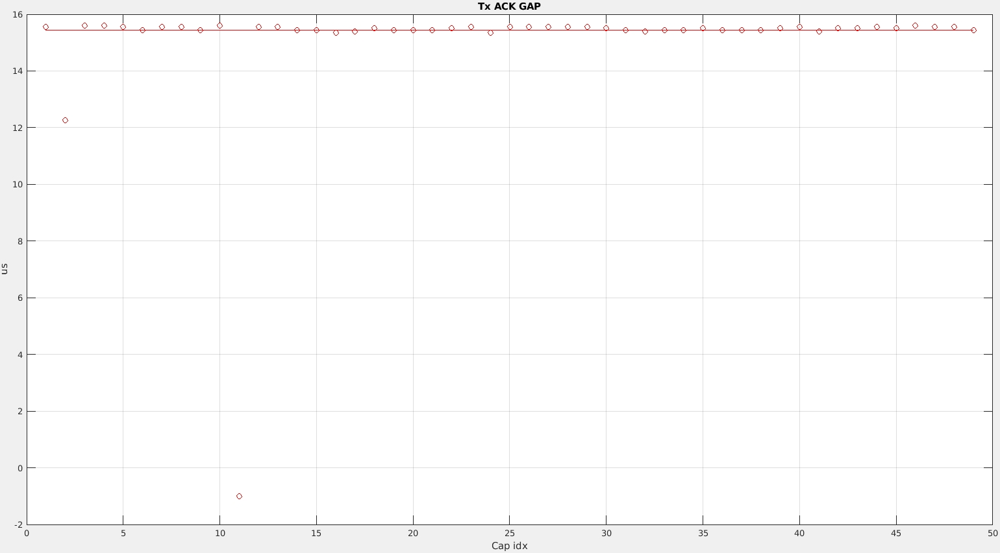
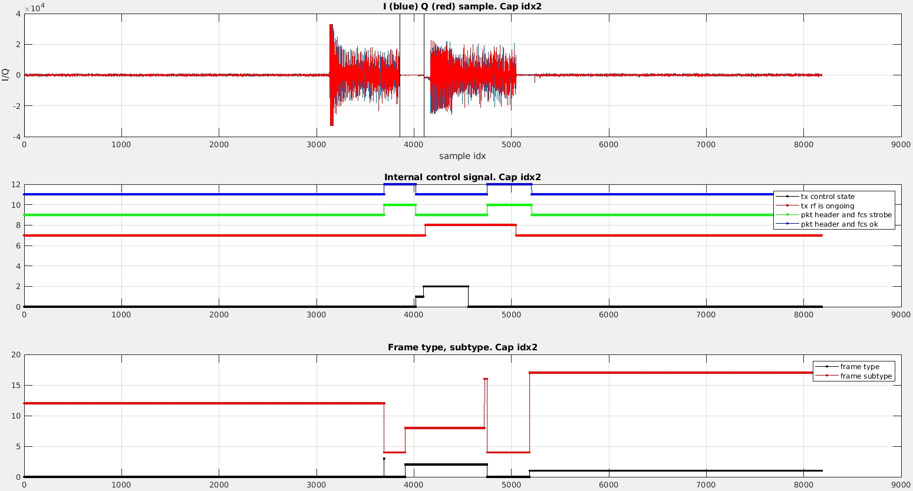
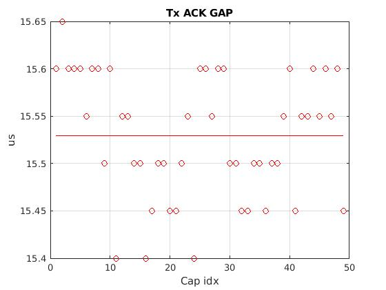

<!--
Author: Xianjun jiao
SPDX-FileCopyrightText: 2023 UGent
SPDX-License-Identifier: AGPL-3.0-or-later
-->

Thsi app note show how to measure the ACK timing based on [**IQ sample capture**](iq.md)

## Quick start
- Setup a normal communication link between the SDR board and other devices. (Check Quick start guide in README or other app notes)
- Setup IQ capture triggered by the event of ACK sending.
  ```
  ./sdrctl dev sdr0 set reg xpu 1 1

  insmod side_ch.ko iq_len_init=8187
  (For smaller FPGA (7Z020), iq_len_init should be <4096, like 4095, instead of 8187)
  
  ./side_ch_ctl wh11d4096
  (For smaller FPGA (7Z020), 4094 should be 2048)

  ./side_ch_ctl wh3h21
  (Enable the IQ capture and configure the correct IQ data composition for ACK timing check)
  
  ./side_ch_ctl wh5h20
  ./side_ch_ctl wh8d16

  ./side_ch_ctl g0
  ```
  The 1st command keeps the receiver always ON to monitor incoming packet and ACK sent by its own. The second and the 3rd command set the capture length and pre trigger length. 
  
  The 4th command sets the target tx_control_state to SEND_DFL_ACK (check tx_control.v) -- the value is defined at bit 7~4, so 0x2 becomes 0x20. 
  Other useful state values: SEND_BLK_ACK 0x30, RECV_ACK 0x60. Other state, such as RECV_ACK_WAIT_SIG_VALID/0x50, is not recommended, otherwise the Matlab analysis script needs to be changed accordingly.
  
  The next command sets the trigger condition to the tx_control_state_hit (index 16. check side_ch_control.v), which means that when the real-time tx_control_state is equal 
  to the target set by previous command, IQ capture will be performed once.

  The trigger condition could also be the combination of tx_control_state and PHY type (0 - Legacy; 1 - HT; 2 - HE) of the received packet. This allows us to monitor 
  the specific ACK Tx GAP after receiving the packet with the specific PHY type. To use this, PHY type should be put into the position of "x", and trigger condition index 
  should be 24 instead of 16.
  ```
  ./side_ch_ctl wh5hx20
  ./side_ch_ctl wh8d24
  ```

- You should see on board outputs like (Be sure running traffics to trigger ACK event!):
  ```
  loop 64 side info count 3
  loop 128 side info count 5
  ...
  ```
  If the second number (side info count 61, 99, ...) keeps increasing, that means the trigger condition is met from time to time and the IQ sample is going to the computer smoothly.
  
- Open another terminal on the computer, and run:
  ```
  cd openwifi/user_space/side_ch_ctl_src
  python3 iq_capture.py
  (for zed, adrv9364z7020, zc702 board, add argument that euqals to iq_len_init, like 4095)
  ```
  While running traffic, you should see 3 figures popped up with run-time **IQ sample**, **AGC gain and lock status** and **RSSI (uncalibrated)**. Meanwhile the python script prints the **timestamp**. In the IQ sample window, IQ samples of two packets are expected in the central position spaced by +/-16us (320 samples), which is the ACK timing.
  
  
  
  While running, all information is also stored into a file **iq.txt**. 

## Test methodology
  The timing of ACK openwifi sent becomes complicated due to different decoding latency of incoming packet when there are different number of bytes/bits in the last OFDM symbol. We should check this after any change that potentially affects the decoding latency.

  To test this, another openwifi board can be used as a client, and sends packets with different numbers of bytes in the last OFDM symbol through all MCSs. Check 
  [this app note](frequent_trick.md#Tx-rate-config) for overriding MCS. The following bash script can be used to send packets in different packet sizes (20 to 60 bytes in this example). DO NOT forget to set up the capture on board and launch the "python3 iq_capture.py" on the computer before running the following commands.
  ```
  for nbyte in {20..60}; do ping 192.168.13.1 -s $nbyte -c 1; sleep 0.3; done
  ```

  Or use any other device/test-box that can send out packet with specified MCS and size towards openwifi board.

## Analyze the ACK timing by Matlab script and Wireshark
  A matlab script **test_iq_file_ack_timing_display.m** is offered to help you do analysis on the ACK timing based on **iq.txt**. For boards with small FPGA (7020), do not forget to give 4095 (**iq_len**) as the 1st argument.
  ```
  test_iq_file_ack_timing_display(8187);
  ```
  Figure 1 shows the timestamp of all received packets. Figure 2~4 shows the IQ sample and related signals of a specific capture. Figure 5 shows the GAP between a received ACK and the packet sent by openwifi -- Rx ACK GAP. Figure 6 shows the GAP between a received packet and the ACK sent by openwifi -- Tx ACK GAP. Normally they should around 16us. "-1" means no such an event is observed at that capture.
  
  
  
  Above figure shows that there are two abnormal GAPs for Tx ACK. One is around 12us (Cap idx 2), the other is -1 (Cap idx 11).

  To look into the details of the capture index 2, that capture index should be given as the 2nd parameter to the Matlab script.
  ```
  test_iq_file_ack_timing_display(8187, 2);
  ```
  
  
  
  From above figure, it was discovered that the DC power caused by AGC action before the actual ACK packet is regarded as the beginning of the ACK packet, that is why the GAP calculation result is smaller. This bug has been fixed already in the Matlab analysis script. Following figure shows the fixed analysis result.
  
  

  To relate the captured IQ snapshot (with ACK timing in it) with the detailed packet information in Wireshark, please check this discussion on github: https://github.com/open-sdr/openwifi/discussions/344 .