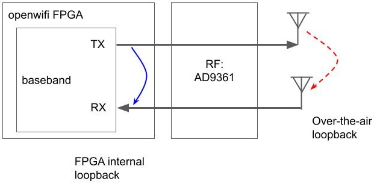
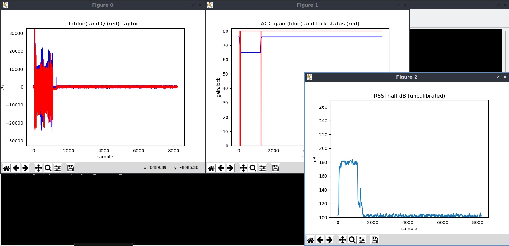
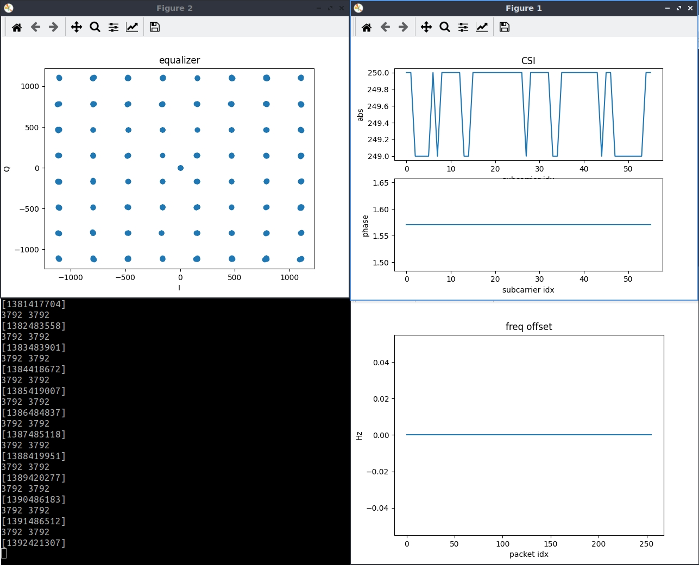

<!--
Author: Xianjun Jiao
SPDX-FileCopyrightText: 2022 UGent
SPDX-License-Identifier: AGPL-3.0-or-later
-->

One super power of the openwifi platform is "**Full Duplex**" which means that openwifi baseband can receive its own TX signal.
This makes the IQ sample, WiFi packet and CSI self loopback test possible. Reading the normal [IQ sample capture app note](iq.md) and [CSI radar app note](radar-self-csi.md) will help if you have issue or want to understand openwifi side channel (for IQ and CSI) deeper.


[[IQ self loopback quick start](#IQ-self-loopback-quick-start)]
[[Check the packet loopback on board](#Check-the-packet-loopback-on-board)]
[[IQ self loopback config](#IQ-self-loopback-config)]
[[CSI FPGA self loopback quick start](#CSI-FPGA-self-loopback-quick-start)]

## IQ self loopback quick start
(Please replace the IQ length **8187** by **4095** if you use low end FPGA board: zedboard/adrv9464z7020/antsdr/zc702/sdrpi)
- Power on the SDR board.
- Put the Tx and Rx antenna as close as possible.
- Connect a computer to the SDR board via Ethernet cable. The computer should have static IP 192.168.10.1. Open a terminal on the computer, and then in the terminal:
  ```
  # ssh into the SDR board, password: openwifi
  ssh root@192.168.10.122
  cd openwifi
  # Bring up the openwifi NIC sdr0
  ./wgd.sh

  # Setup monitor mode in WiFi channel 44. You should find a channel as clean as possible in your location. Note that some channels don't work, so stick to 44 or 48 for now.
  ./monitor_ch.sh sdr0 44

  # Turn off CCA by setting a very high threshold that make the CSMA engine always think the channel is idle (no incoming signal is higher than this threshold)
  ./sdrctl dev sdr0 set reg xpu 8 1000
  
  # Load side channel kernel module with buffer lenght of 8187 (replace this with 4095 when using low end FPGA board)
  insmod side_ch.ko iq_len_init=8187
  
  # Set 100 to register 11. It means the pre trigger length is 100, so we mainly capture IQ after trigger condition is met
  ./side_ch_ctl wh11d100
  # Set 16 to register 8 -- set trigger condition to phy_tx_started signal from openofdm tx core
  ./side_ch_ctl wh8d16
  # Unmute the baseband self-receiving to receive openwifi own TX signal/packet -- important for self loopback!
  ./sdrctl dev sdr0 set reg xpu 1 1
  # Set the loopback mode to over-the-air
  ./side_ch_ctl wh5h0
  (./side_ch_ctl wh5h4 for FPGA internal loopback)
  # Relay the FPGA IQ capture to the host computer that will show the captured IQ later on)
  ./side_ch_ctl g0
  ```
  You should see on outputs like:
  ```
  loop 22848 side info count 0
  loop 22912 side info count 0
  ...
  ```
  Now the count is always 0, because we haven't instructed openwifi to send packet for loopback test.
  
- Leave above ssh session untouched. Open a new ssh session to the board from your computer. Then run on board:
  ```
  cd openwifi/inject_80211/
  make
  # Build our example packet injection program
  ./inject_80211 -m n -r 5 -n 1 sdr0
  # Inject one packet to openwifi sdr0 NIC
  ```
  Normally in the previous ssh session, the count becomes 1. It means one packet (of IQ sample) is sent and captured via loopback over the air.
  
  If 1 is not seen, you can try to put the receiver into reset state, so it won't block the system in case it runs into dead state
  ```
  ./sdrctl dev sdr0 set reg rx 0 1
  ```

- On your computer (NOT ssh onboard!), run:
  ```
  cd openwifi/user_space/side_ch_ctl_src
  python3 iq_capture.py 8187
  ```
  You might need to install beforehand: "sudo apt install python3-numpy python3-matplotlib python3-tk".
  
- Leave the above host session untouched. Let's go to the second ssh session (packet injection), and do single packet Tx again:
  ```
  ./inject_80211 -m n -r 5 -n 1 sdr0
  ```
  Normally in the 1st ssh session, the count becomes 2. You should also see IQ sample capture figures like this:
  
  
- Stop the python3 script, which plots above, in the host session. A file **iq.txt** is generated. You can use the Matlab script test_iq_file_display.m 
to do further offline analysis, or feed the IQ sample to the openwifi receiver simulation, etc.

## Check the packet loopback on board

- While signal/packet is looped back, you can capture it on board via normal sniffer program for further check/analysis on the packet (bit/byte level instead of IQ level), such as tcpdump or tshark.
  A new ssh session to the board should be opened to do this before running the packet injection:
  ```
  tcpdump -i sdr0
  ```
  Run the packet injection "./inject_80211 -m n -r 5 -n 1 sdr0" in another session, you should see the packet information printed by tcpdump from self over-the-air loopback. In case you put the receiver into reset state in the previous IQ loopback, you should put the receiver back to normal for packet loopback (otherwise the receiver won't decode the IQ signal back to packet):
  ```
  ./sdrctl dev sdr0 set reg rx 0 0
  ```
  
- You can also see the openwifi printk message of Rx packet (self Tx looped back) while the packet comes to the openwifi Rx interrupt.
  A new ssh session to the board should be opened to do this before running the packet injection:
  ```
  cd openwifi
  ./sdrctl dev sdr0 set reg drv_rx 7 7
  ./sdrctl dev sdr0 set reg drv_tx 7 7
  # Turn on the openwifi Tx/Rx printk logging
  ```
  Stop the "./side_ch_ctl g0" in the very first ssh session. Run the packet injection, then check the printk message:
  ```
  ./inject_80211/inject_80211 -m n -r 5 -n 1 sdr0
  dmesg
  ```
  You should see the printk message of packet Tx and Rx from the openwifi driver (sdr.c).

## IQ self loopback config

- By default, the loopback is via the air (from Tx antenna to Rx antenna). FPGA inernal loopback option is offered to have IQ sample and packet without 
  any interference. To have FPGA internal loopback, replace the "./side_ch_ctl wh5h0" during setup (the very 1st ssh session) by:
  ```
  ./side_ch_ctl wh5h4
  ```
- Lots of packet injection parameters can be set: number of packet, type (data/control/management), MCS/rate, size, interval, etc. Please run the packet injection
  program without any arguments to see the help.
  
- Besides the packet Tx via injection over monitor mode for loopback test, normal WiFi mode (AP/Client/ad-hoc) can also run together with self loopback. 
  For instance, run **fosdem.sh** instead of **wgd.sh** to setup an openwifi AP that will transmit beacons. The wgd.sh can also be replaced with other scenario
  setup scripts. Please check [Application notes](README.md)

- To understand deeper of all above commands/settings, please refer to [Capture IQ sample, AGC gain, RSSI with many types of trigger condition](iq.md) and
  [Capture dual antenna TX/RX IQ for multi-purpose (capture collision)](iq_2ant.md)
  
## CSI FPGA self loopback quick start

This section will show how to connect the WiFi OFDM transmitter to the receiver directly inside FPGA, and show the ideal CSI/constellation/frequency-offset. (For CSI over the air loopback, please refer to [CSI radar app note](radar-self-csi.md))

Command sequence on board:
```
cd openwifi
./wgd.sh
./monitor_ch.sh sdr0 6
insmod side_ch.ko
./side_ch_ctl g
```
Open another ssh session on board, then:
```
cd openwifi
./sdrctl dev sdr0 set reg rx_intf 3 256
(Above command let the FPGA Tx IQ come to receiver directly. Set 256 back to 0 to let receiver back connect to AD9361 RF frontend)
./sdrctl dev sdr0 set reg rx 5 768
(Disable the receiver FFT window shift. By default it is 1 (768+1) -- good for multipath, overfitting for direct loopback)
./inject_80211/inject_80211 -m n -r 7 -n 99999 -s 1400 -d 1000000 sdr0
(Transmit 802.11n MCS7 1400Byte packet every second)
```

Command on computer:
```
cd openwifi/user_space/side_ch_ctl_src
python3 side_info_display.py
```
Now you should see the following screenshot that shows the CSI/constellation/frequency-offset over this in-FPGA ideal channel.

