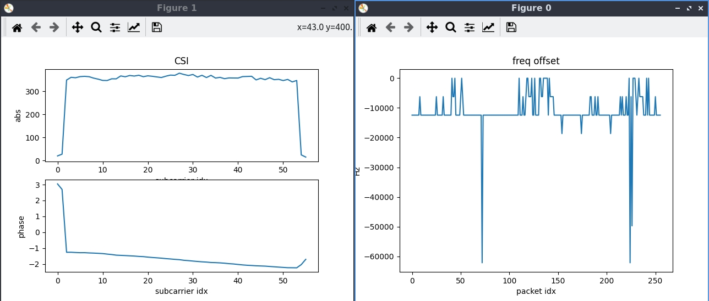

<!--
Author: Xianjun jiao
SPDX-FileCopyrightText: 2019 UGent
SPDX-License-Identifier: AGPL-3.0-or-later
-->

One super power of the openwifi platform is "**Full Duplex**" which means that openwifi baseband can receive its own TX signal. Just like a radar! This brings a unique capability of "**joint radar and communication**" to openwifi. For instance, put two directional antennas to openwifi TX and RX, and the **CSI** (Channel State Information) of the self-TX signal will refect the change of the target object.
 

## Quick start
- Power on the SDR board.
- Connect a computer to the SDR board via Ethernet cable. The computer should have static IP 192.168.10.1. Open a terminal on the computer, and then in the terminal:
  ```
  ssh root@192.168.10.122
  (password: openwifi)
  cd openwifi
  ./fosdem.sh
  (After the AP started by above command, you can connect a WiFi client to this openwifi AP)
  (Or setup other scenario according to your requirement)
  ifconfig
  (Write down the openwifi AP MAC address. For example 66:55:44:33:22:5a)
  insmod side_ch.ko num_eq_init=0
  ./side_ch_ctl wh1h4001
  ./side_ch_ctl wh7h4433225a
  (Above two commands ensure receiving CSI only from XX:XX:44:33:22:5a. In this case, it is the openwifi self-TX)
  ./sdrctl dev sdr0 set reg xpu 1 1
  (Above unmute the baseband self-receiving to receive openwifi own TX signal/packet)
  ./side_ch_ctl g0
  ```
  You should see on board outputs like:
  ```
  loop 64 side info count 4
  loop 128 side info count 5
  ...
  ```
  If the second number (4, 5, ...) keeps increasing, that means the CSI is going to the computer smoothly.
  
- On your computer (NOT ssh onboard!), run:
  ```
  cd openwifi/user_space/side_ch_ctl_src
  python3 side_info_display.py 0
  ```
  The python script needs "matplotlib.pyplot" and "numpy" packages installed. Now you should see figures showing run-time **CSI** and **frequency offset**. Meanwhile the python script prints the **timestamp**.
  
  
  While running, all CSI data is also stored into a file **side_info.txt**. A matlab script **test_side_info_file_display.m** is offered to help you do CSI analysis offline. In this case, run **test_side_info_file_display(0)** in Matlab.
  
  
Please learn the python and Matlab script for CSI data structure per packet according to your requirement.
  
Do read the [normal CSI app note](csi.md) to understand the basic implementation architecture.
