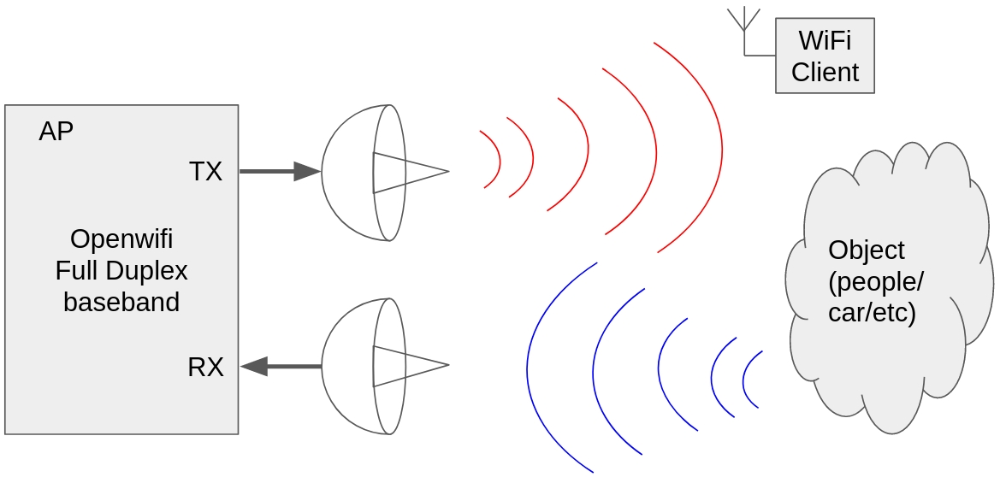
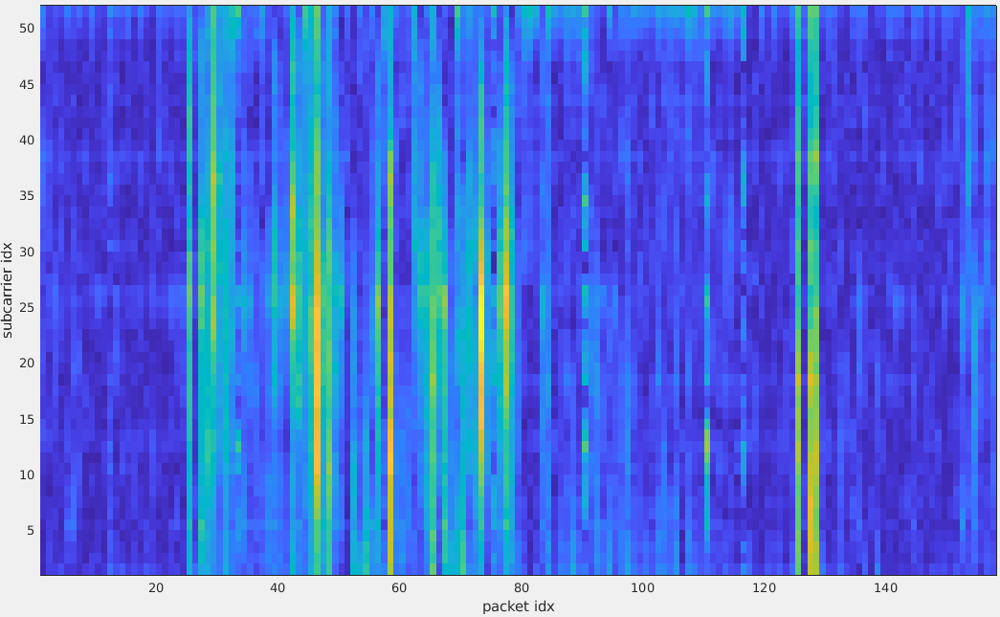
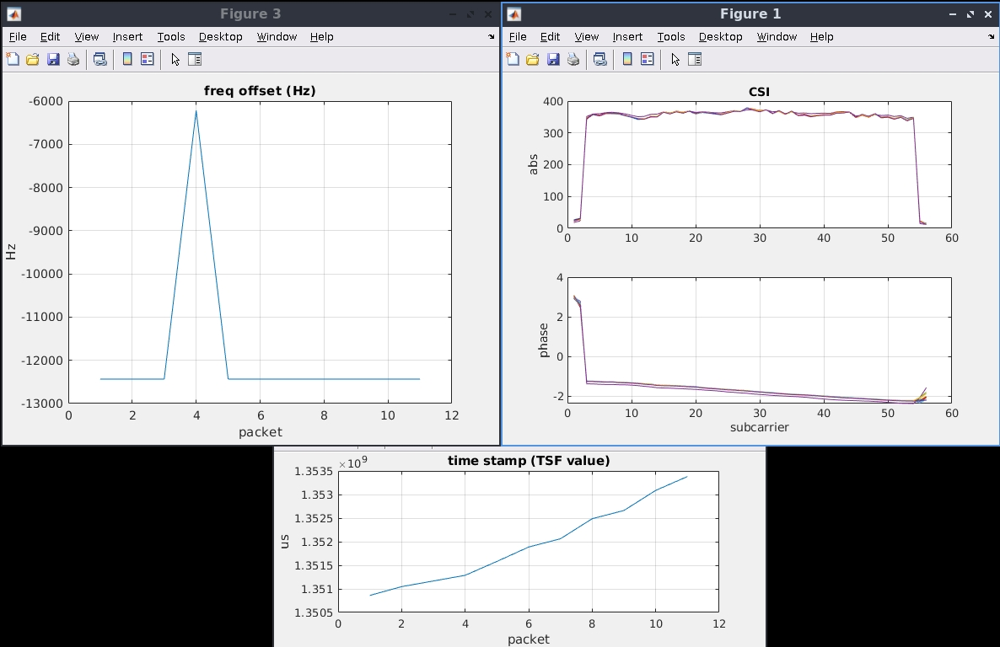

<!--
Author: Xianjun jiao
SPDX-FileCopyrightText: 2019 UGent
SPDX-License-Identifier: AGPL-3.0-or-later
-->

One super power of the openwifi platform is "**Full Duplex**" which means that openwifi baseband can receive its own TX signal. Just like a radar! This brings a unique capability of "**joint radar and communication**" to openwifi. For instance, put two directional antennas to openwifi TX and RX, and the **CSI** (Channel State Information) of the self-TX signal will refect the change of the target object.
 
 

(See this https://github.com/open-sdr/openwifi/discussions/344 to understand how to map the collected data to the packet via the TSF timestamp)

## Quick start
- Power on the SDR board.
- Connect a computer to the SDR board via Ethernet cable. The computer should have static IP 192.168.10.1. Open a terminal on the computer, and then in the terminal:
  ```
  ssh root@192.168.10.122
  (password: openwifi)
  ```
- On computer, build the latest driver and FPGA package after clone/update openwifi and openwifi-hw-img repository:
  ```
  export XILINX_DIR=your_Xilinx_install_directory
  (Example: export XILINX_DIR=/opt/Xilinx. The Xilinx directory should include sth like: Downloads, Vitis, etc.)
  export OPENWIFI_HW_IMG_DIR=your_openwifi-hw-img_directory
  (The directory where you get the open-sdr/openwifi-hw-img repo via git clone)
  export BOARD_NAME=your_board_name
  (Check the BOARD_NAME definitions in README)

  cd openwifi/user_space
  ./drv_and_fpga_package_gen.sh $OPENWIFI_HW_IMG_DIR $XILINX_DIR $BOARD_NAME
  scp drv_and_fpga.tar.gz root@192.168.10.122:openwifi/
  scp ./side_ch_ctl_src/side_ch_ctl.c root@192.168.10.122:openwifi/
  scp ./inject_80211/* root@192.168.10.122:openwifi/inject_80211/
  ```
- On SDR board (/root/openwifi directory):
  ```
  cd /root/openwifi/
  ./wgd.sh drv_and_fpga.tar.gz
  ./monitor_ch.sh sdr0 1
  insmod ./drv_and_fpga/side_ch.ko
  gcc -o side_ch_ctl side_ch_ctl.c
  ./side_ch_ctl wh1h4001
  ./side_ch_ctl wh7h4433225a
  (Above two commands ensure receiving CSI only from XX:XX:44:33:22:5a, which will be set by our own packet injector later)
  ./sdrctl dev sdr0 set reg xpu 1 1
  (Above unmute the baseband self-receiving to receive openwifi own TX signal/packet)
  ./side_ch_ctl g0
  ```
- Open another ssh session on SDR board:
  ```
  cd /root/openwifi/inject_80211
  make
  ./inject_80211 -m g -r 4 -t d -e 0 -b 5a -n 99999999 -s 20 -d 1000 sdr0

  (Above command injects the 802.11a/g packet, for 802.11n packet please use:
  ./inject_80211 -m n -r 4 -t d -e 8 -b 5a -n 99999999 -s 20 -d 1000 sdr0)
  ```
- Now you should see the increasing numbers in the previous ssh terminal of the SDR board.
- On your computer (NOT ssh session!), run:
  ```
  cd openwifi/user_space/side_ch_ctl_src
  python3 side_info_display.py 8 waterfall
  ```
  You might need to install beforehand: "sudo apt install python3-numpy python3-matplotlib python3-tk". Now you should see figures showing run-time **CSI**, **CSI waterfall**, **Equalizer out** and **frequency offset**. The following photo shows the CSI change in the waterfall plot when I left my seat in front of two directional antennas (Tx/Rx antenna).
  
  
  While running, all CSI data is also stored into a file **side_info.txt**. A matlab script **test_side_info_file_display.m** is offered to help you do CSI analysis offline. In this case, run **test_side_info_file_display** in Matlab.
  
  
Please learn the python and Matlab script for CSI data structure per packet according to your requirement.
  
Do read the [normal CSI app note](csi.md) to understand the basic implementation architecture.
