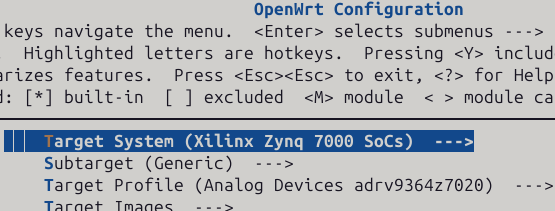
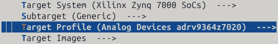
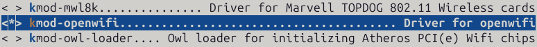

<!--
Author: Robbe Gaeremynck
SPDX-FileCopyrightText: 2019 UGent
SPDX-License-Identifier: AGPL-3.0-or-later
-->
<!--❌ --> 

# Using openwifi with OpenWrt
## Table of contents
- [Support matrix](#support-matrix)
- **[Quick start: Openwifi AP using prebuild OpenWrt image](#quick-start-openwifi-ap-using-prebuild-openwrt-image)**
- **[Usage examples: IQ & CSI capture](#usage-examples-iq--csi-capture)**
- **[Creating an OpenWrt image with openwifi installed for a supported board](#creating-an-openwrt-image-with-openwifi-installed-for-a-supported-board)**
- [Tips and tricks for openwifi on OpenWrt](#tips-and-tricks-for-openwifi-on-openwrt)
- [Debugging](#debugging)
- [Known issues](#known-issues)

# Support matrix

(In case a board that we support does not work, contact us)

| Board         | Supported | Tested | Comments |
|---------------|-----------|--|----------|
| zc706_fmcs2   | ✅ | ✅ | |
| zed_fmcs2     | ✅ | ✅ | |
| adrv9364z7020 | ✅ | ✅ | |
| adrv9361z7035 | ✅ | ✅ | |
| zc702_fmcs2   | ✅ |  | |
| antsdr        | ✅ |  | |
| e310v2        | ✅ |  | |
| antsdr_e200   | ✅ |  | |
| sdrpi         | ✅ |  | |
| zcu102_fmcs2  | ✅ | ✅ | ⚠️ Fails on some boards, see [here](../../known_issue/notter.md#no-uart-output-on-zcu102). |
| neptunesdr    | ✅ |  | |

# Quick start: Openwifi AP using prebuild OpenWrt image
This is the equivalent of the ./fosdem.sh demo used for kuiper but via OpenWrt its web interface LuCi.

Instructions to use prebuild OpenWrt image with openwifi support.
Do note that these images contain the bare minimum for openwifi to run.

Download image for your board [here]() and flash it to SD card using instructions [below](#unzip-image--flash-image).

## Unzip & flash image
Flash image to SD card, assuming you downloaded the prebuild image for adrv9364z7020 (if not, beware of the paths).

Run the following command to change directory to ~/Downloads and unzip img.gz:
```
cd ~/Downloads && gunzip openwrt-zynq-generic-analog_devices_zynq-adrv9364-squashfs-sdcard.img.gz
```
Flash image to SD card:
```
sudo dd if=~/Downloads/openwrt-zynq-generic-analog_devices_zynq-adrv9364-squashfs-sdcard.img of=/dev/mmcblk0 status=progress
```

## First boot & internet access
Boot the board. After a minute, the 'openwrt-openwifi' SSID should now be discoverable by your phone (2.4 GHz, channel 1)!
If you connect, you will get an IP address but no internet access.

To enable internet access, connect the board via Ethernet cable to your PC, it will by default assign ```192.168.10.1```.
Check the interface names on your pc via ```ip addr```.

Run (first argument is interface with internet access, second one to board):
```
./give_board_internet_access.sh wlan0 eth0
```

**Done!** Both the board and the connected clients should have internet access.

**Note:** The default OpenWrt network configuration when openwifi package is installed; is for research, not for deployment.
If you want to deploy the board, ensure that its ```eth0``` interface is in the **wan** zone and is **DHCP client** instead of DHCP server, the wireless network can be assigned to lan.

### Extra: Access LuCi, OpenWrt's web interface
Open the web browser and surf to ```http://192.168.10.122``` on your PC, or to ```http://192.168.13.1``` on a device connected to 'openwrt-openwifi'.
The following webpage should appear (first login, by default there is no password set, I recommend to change this for use in actual deployment):


Go to **Network -> Wireless** and the following page should be shown:


Here you can tweak the wireless settings however you prefer.

# Usage examples: IQ & CSI capture
Assumes you previously performed the [quick start](#quick-start-openwifi-ap-using-prebuild-openwrt-image).
Note that current [app notes](../../app_notes/README.md) for Kuiper are also valid for OpenWrt with some minor differences.

## IQ capture
Ssh to board, install side_ch kernel module, and set trigger conditions.
```
ssh root@192.168.10.122
insmod side_ch iq_len_init=4095
side_ch_ctl wh11d0 % Set pre-trigger length
```
Start the transmission from the client (openwifi board), to the server (host PC):
```
side_ch_ctl g
```

On the host PC:
```
cd openwifi/user_space/side_ch_ctl_src
python3 iq_capture.py 4095
```

## CSI capture
Ssh to board, install side_ch kernel module.
```
ssh root@192.168.10.122
insmod side_ch
```
Start the transmission from the client (openwifi board), to the server (host PC):
```
side_ch_ctl g
```

On the host PC:
```
cd openwifi/user_space/side_ch_ctl_src
python3 side_info_display.py
```

# Creating an OpenWrt image with openwifi installed for a supported board
The instructions are given as if you were to build everything in this directory.

## Prerequisites
We recommend to build OpenWrt inside a docker container (conform the instructions below).
As such, the only real prerequisite is **Docker installed** on a Linux machine (did not try Windows).
Vivado installation is **not** required.

## Cloning the OpenWrt source code
The OpenWrt v24.10 (Linux kernel v6.6, mac80211 v6.12) source with openwifi support is found [here](https://github.com/open-sdr/openwrt-openwifi).
```
git clone https://github.com/open-sdr/openwrt-openwifi.git
```

## Building the container
Instructions on how to set up this container are found [here](https://openwrt.org/docs/guide-user/virtualization/obtain.firmware.docker).

```
docker build --rm --tag openwrt:debian_12 --file ./Dockerfile ./openwrt-openwifi
```

## Starting the container
```
./start_docker_openwrt_build.sh
```

## Update package feeds
Running this command will retrieve the openwrt-openwifi-packages-feed found [here](https://github.com/open-sdr/openwrt-openwifi-packages-feed).
The package feed for openwifi is added in OpenWrt by editing its feeds.conf.default file.
By default, the feed source should be git.
If you want to edit the feed, you should use a local source of feed, see [here](#use-local-source-of-package-feed).
```
./scripts/feeds update
./scripts/feeds install -a
```

## Configure build
### Default configuration
**Bare minimum** default configurations of OpenWrt with openwifi selected are provided in ./openwrt-openwifi/configs folder.

```
cp configs/adrv9364z7020_defconfig .config
```

### Manual configuration
```
make menuconfig
```
Select:
- Architecture (zynq or zynqmp)

- Board

- Openwifi kernel module under:
  - Kernel Modules
  
  
  
  - Wireless Drivers
  
  
  
  - Openwifi kernel package
  
  

- Other packages you may want to use with openwifi/OpenWrt. Recommendations:
    - Network -> SSH -> openssh-sftp-server (Allows use of scp command to board)
    - Utilities -> Editors -> nano (Or stick to vim)

Save and exit menuconfig.

## Build
```
make -j$(PKG_JOBS) V=sc
```
We recommend to keep the number of jobs low (~3) works fine.
Increasing number of jobs decreases build time put risks error due to dependencies.
If it throws an error, try to resume the build with fewer jobs.

## Flash image
Exit the docker container (Ctrl + D).
See [Unzip & flash image](#unzip--flash-image) (mind the different paths).


# Tips and tricks for openwifi on OpenWrt

## Using userspace tools
The openwifi kernel package inside the openwifi packages feed for OpenWrt does the following:
- Install all files under user_space folder to */root/openwifi* on the board. This implies that **most commands and scripts used in the application notes can be used on OpenWrt without much issue.**
- Install **userspace tool executables** (sdrctl, inject_80211, analyze_80211, side_ch_ctl) under */usr/bin*, which is **part of $PATH**. Hence, there is no need to use ./ and be in the correct directory to run most commands used with openwifi.

## Loading kernel modules
All openwifi kernel modules are packed into OpenWrt by default, no need to manually copy them.

You want to insert side_ch.ko? Use:

```
insmod side_ch
```

## SSH to the board
The board automatically starts with IP assignment via DHCP.
```
ssh root@openwrt.lan
```
(No password required)

# Debugging

## Use local source to build package, not git
Easiest way to debug using this workflow is to mount extra volumes into the container on start. For example, to debug openwifi package add to start_docker_openwrt_build.sh command:
```
--volume "$(pwd)/openwifi:/openwifi" \
```
Edit the openwifi packages to use the locally provided source at /openwifi. As the openwifi package is part of the openwifi packages feed for openwrt, to change the openwifi package, you will need to perform [the instructions](#use-local-source-of-package-feed) below.

## Use local source of package feed
- Clone the openwifi packages feed from [here](https://github.com/open-sdr/openwrt-openwifi-packages-feed).
- Follow instructions [above](#use-local-source-to-build-package-not-git) to mount source in container.
- Edit OpenWrt its feeds.conf.default file and replace the default src-git openwifi feed entry by:
```
src-link openwifi /openwrt-openwifi-packages-feed
```

## Easy access to container paths
You can mount --bind the openwrt source under /workdir, making it possible to copy and paste paths shown in the docker container.

# Known issues
There are some known issues that are OpenWrt specific, these can be consulted [here](../../known_issue/notter.md#known-issues-specific-to-openwrt).