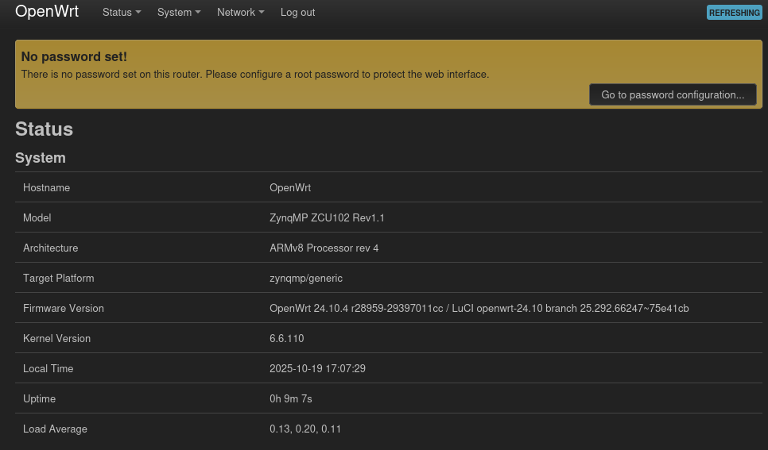
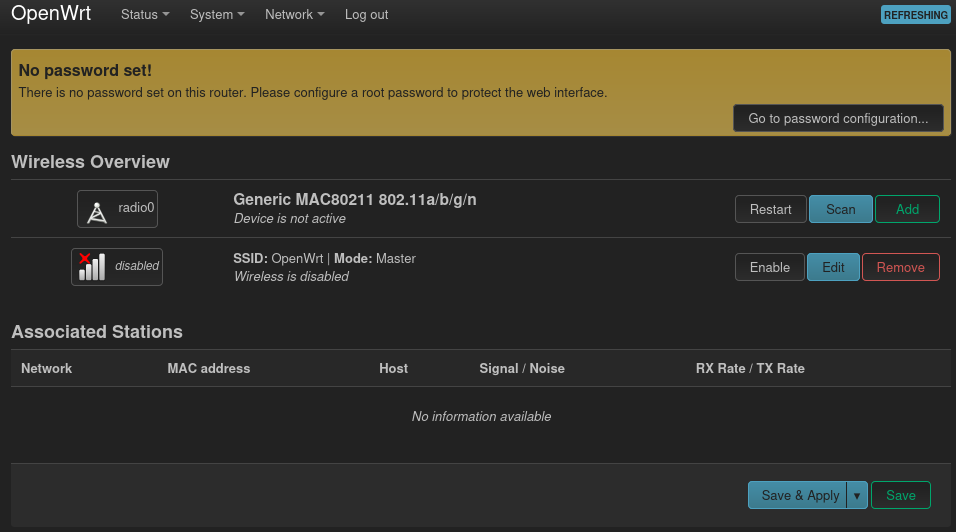

<!--
Author: Robbe Gaeremynck
SPDX-FileCopyrightText: 2019 UGent
SPDX-License-Identifier: AGPL-3.0-or-later
-->
<!--❌ --> 

# Using openwifi with OpenWrt
## Table of contents
- [Support matrix](#support-matrix)
- **[Getting started: Creating an OpenWrt image with openwifi installed for a supported board + usage example](#creating-an-openwrt-image-with-openwifi-installed-for-a-supported-board)**
- [Tips and tricks for openwifi on OpenWrt](#tips-and-tricks-for-openwifi-on-openwrt)
- [Debugging](#debugging)
- [Known issues](#known-issues)

# Support matrix
| Board | Supported | Tested | Comments |
|-------|-----------|--------|----------|
| zc706_fmcs2 | ✅ |  | |
| zed_fmcs2 | ✅ | | |
| adrv9364z7020 | ✅ | | |
| adrv9361z7035 | ✅ |  | |
| zc702_fmcs2 | ✅ | | |
| antsdr | ✅ | | |
| e310v2 | ✅ | | |
| antsdr_e200 | ✅ | | |
| sdrpi | ✅ | | |
| zcu102_fmcs2 | ✅ | ✅ | ⚠️ Fails on some boards, see [here](../../known_issue/notter.md#no-uart-output-on-zcu102). |
| neptunesdr | ✅ | | |

# Creating an OpenWrt image with openwifi installed for a supported board
The instructions are given as if you were to build everything in this directory.

## Prerequisits
We highly advice to build OpenWrt inside a docker container (conform the instructions below). As such, the only real prerequisite is **Docker installed** on a Linux machine (did not try Windows). Vivado installation is **not** required.

## Cloning the OpenWrt source code
The OpenWrt v24.10 (Linux kernel v6.6, mac80211 v6.12) source with openwifi support is found [here](https://github.com/open-sdr/openwrt-openwifi).
```
git clone https://github.com/open-sdr/openwrt-openwifi.git
```

## Building the container
Instructions on how to set up this container are found [here](https://openwrt.org/docs/guide-user/virtualization/obtain.firmware.docker).

```
docker build --rm --tag openwrt:debian_12 --file ./Dockerfile ./openwrt-openwifi
```

## Starting the container
```
./start_docker_openwrt_build.sh
```

## Update package feeds
Running this command will retrieve the openwrt-openwifi-packages-feed found [here](https://github.com/open-sdr/openwrt-openwifi-packages-feed). The package feed for openwifi is added in OpenWrt by editing its feeds.conf.default file. By default, the feed source should be git. If you want to edit the feed, you should use a local source of feed, see [here](#use-local-source-of-package-feed).
```
./scripts/feeds update
./scripts/feeds install -a
```

## Configure build
```
make menuconfig
```
Select:
- Architecture (zynq or zynqmp)
- Board
- Openwifi kernel module under:
    - Kernel Modules -> Wireless Drivers -> openwifi (compilation of user space tools is optional). Note that selecting openwifi will by default also select LuCi (OpenWrt its web interface). 
- Other packages you may want to use with openwifi/OpenWrt. Recommendations:
    - Network -> SSH -> openssh-sftp-server (Allows use of scp command to board)

Save config.

## Build
```
make -j$(PKG_JOBS) V=sc
```
We recommend to keep the number of jobs low (~3) works fine.
Increasing number of jobs decreases build time put risks error due to dependencies.
If it throws an error, try to resume the build with fewer jobs.

## Usage example: Create openwifi AP via LuCi
This is the equivalent of the ./fosdem.sh demo used for kuiper but via OpenWrt its web interface LuCi. 

**The board should automatically boot with IP address assignment via DHCP.** Hence, you can plug it into your home network and surf to the following url:
```
http://openwrt.lan
```
It can be that openwrt.lan should be replaced by its actual IP address.

**In case this would fail or you prefer a static IP**, you can connect via UART and change the network config under */etc/config/network*. To set a static IP typical to a home router, change br-lan config to:
```
config interface 'lan'
    option device 'br-lan'
    option proto 'static'
    option ipaddr '192.168.1.1'
    option netmask '255.255.255.0'
```
Changes are applied after */etc/init.d/network restart*. DNS and gateway can also be set here or later in LuCi.

The following webpage should appear (first login, by default there is no password set, I advice to change this for use in actual deployment):



Go to **Network -> Wireless**



Click on **Enable**.

Done!


# Tips and tricks for openwifi on OpenWrt

## Using userspace tools
The openwifi kernel package inside the openwifi packages feed for OpenWrt does the following:
- Install all files under user_space folder to */root/openwifi* on the board. This implies that **most commands and scripts used in the application notes can be used on OpenWrt without much issue.**
- Install **userspace tool executables** (sdrctl, inject_80211, analyze_80211, side_ch_ctl) under */usr/bin*, which is **part of $PATH**. Hence, there is no need to use ./ and be in the correct directory to run most commands used with openwifi.

## Loading kernel modules
All openwifi kernel modules are packed into OpenWrt by default, no need to manually copy them.

You want to insert side_ch.ko? Use:

```
insmod side_ch
```

## SSH to the board
The board automatically starts with IP assignment via DHCP.
```
ssh root@openwrt.lan
```
(No password required)

# Debugging

## Use local source to build package, not git
Easiest way to debug using this workflow is to mount extra volumes into the container on start. For example, to debug openwifi package add to start_docker_openwrt_build.sh command:
```
--volume "$(pwd)/openwifi:/openwifi" \
```
Edit the openwifi packages to use the locally provided source at /openwifi. As the openwifi package is part of the openwifi packages feed for openwrt, to change the openwifi package, you will need to perform [the instructions](#use-local-source-of-package-feed) below.

## Use local source of package feed
- Clone the openwifi packages feed from [here](https://github.com/open-sdr/openwrt-openwifi-packages-feed).
- Follow instructions [above](#use-local-source-to-build-package-not-git) to mount source in container.
- Edit OpenWrt its feeds.conf.default file and replace the default src-git openwifi feed entry by:
```
src-link openwifi /openwrt-openwifi-packages-feed
```

## Easy access to container paths
You can mount --bind the openwrt source under /workdir, making it possible to copy and paste paths shown in the docker container.

# Known issues
There are some known issues that are OpenWrt specific, these can be consulted [here](../../known_issue/notter.md#known-issues-specific-to-openwrt).