# ANTSDR-E200

ANTSDR-E200 is similar to MicroPhase ANTSDR-E310 device. 

ANTSDR-E200 has a smaller size and some differences in hardware structure. The ethernet is placed at the PL side.

Since the performance of the zynq processor is not very strong, the Ethernet cannot run at a very high bandwidth. For some SDR applications, the Ethernet may be required to transmit baseband signals above 20MSPS sample rate. In this case, the bandwidth of the Ethernet  will reach 80MB/s. If the Ethernet on the PS side wants to run at this bandwidth, it will take up a lot of CPU resources and the bandwidth is still difficult to meet. For this reason, we moved the network port to the PL side.

But this has no effect on IIO-based SDR drivers, because we still use ZYNQ's GEM controller. O(∩_∩)O

When we moved the ethernet to PL, the ANTSDR-E200 could support UHD driver, If anyone is interested in this, you can refer to our project [antsdr_uhd](https://github.com/MicroPhase/antsdr_uhd). 

