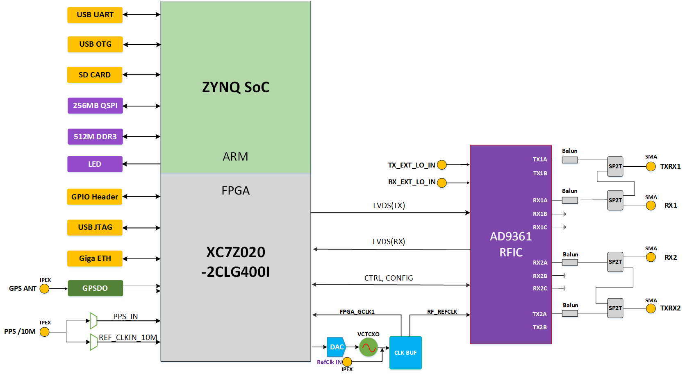

# ANTSDR-E310V2

**AntSDR E310V2** is a powerful and versatile  software-defined radio (SDR) platform. It is a low-cost, easy-to-use  system for developing, testing, and deploying wireless communication  solutions such as LTE, GSM, and Wi-Fi. With its wide range of supported  frequencies and modulation schemes, it’s possible to easily experiment  with various wireless technologies.

Based on the  original version, we have optimized the RF performance, added a GPS  module, increased an external 10M/PPS input interface, and used a VCXO.  The combination of VCXO and external reference input with DAC can  generate a more accurate and stable clock. In addition, the Ethernet on  the PL makes it possible for E310V2 to be compatible with UHD for higher bandwidth transmission.

 If you are interested in using UHD with E310V2, you can find more information in our [repository](https://github.com/MicroPhase/antsdr_uhd).

